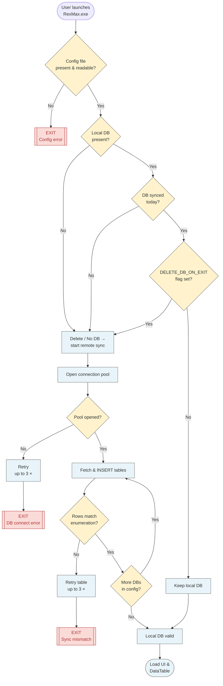
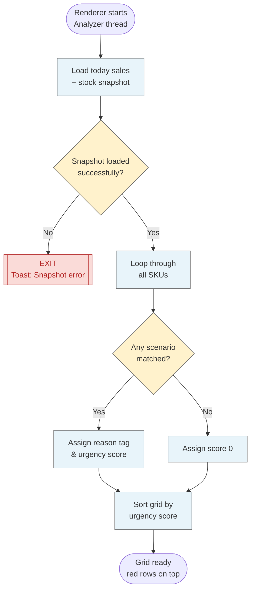
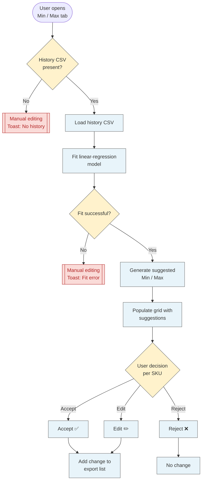
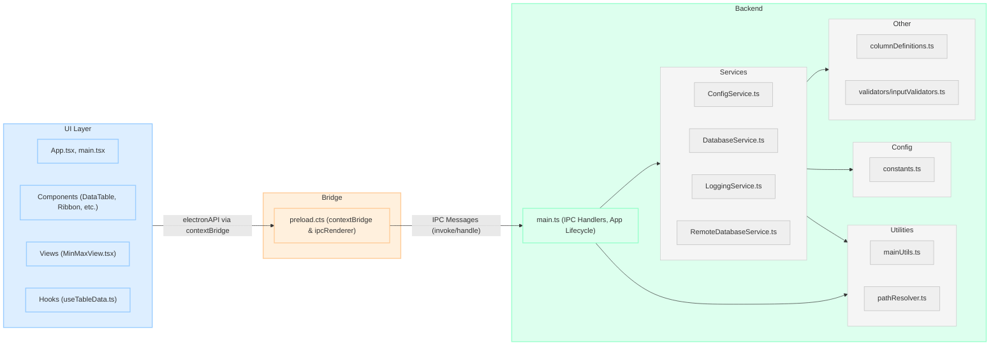
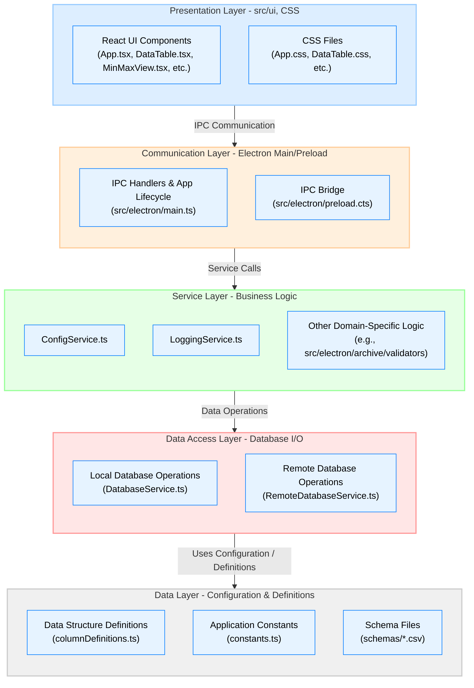
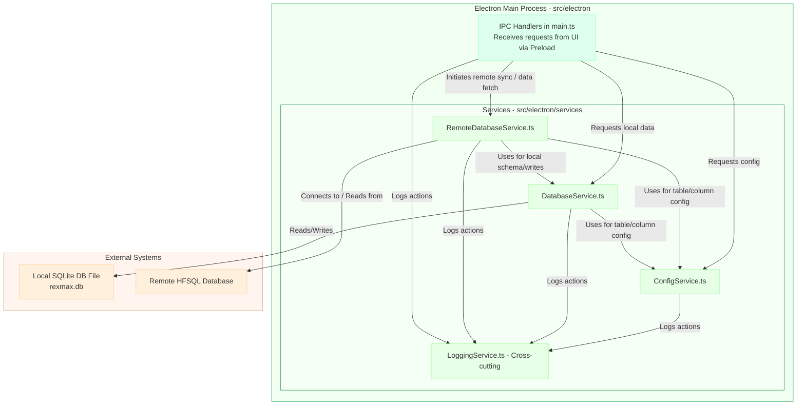
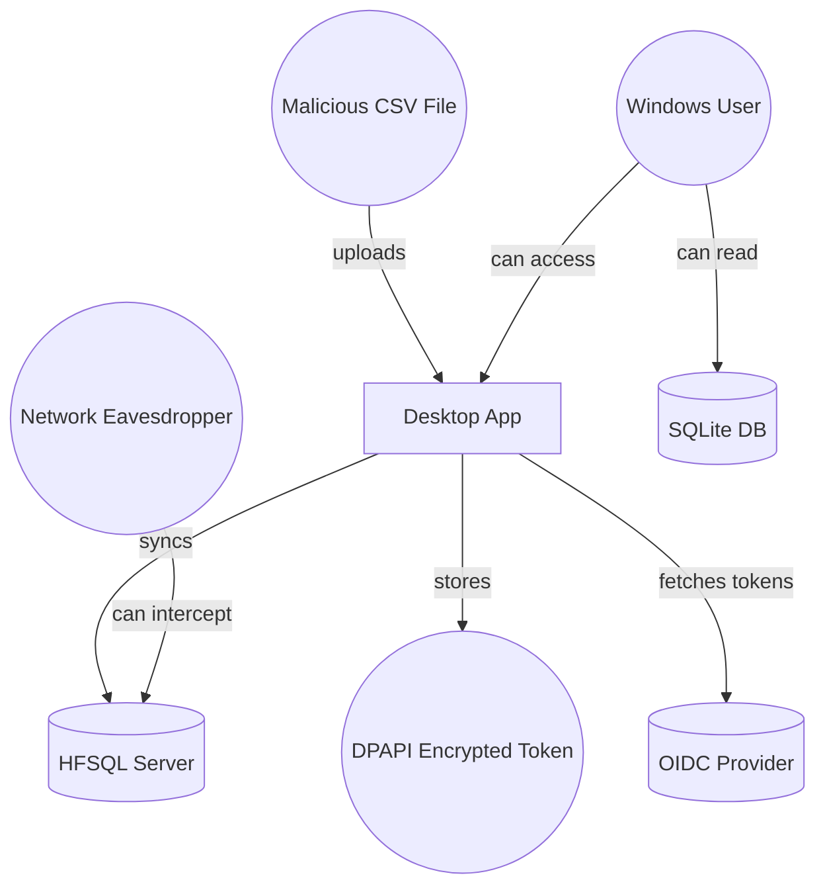
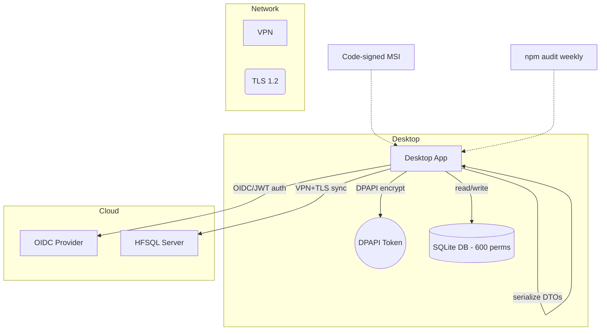
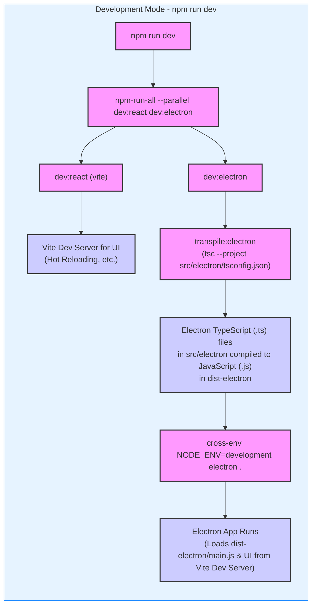
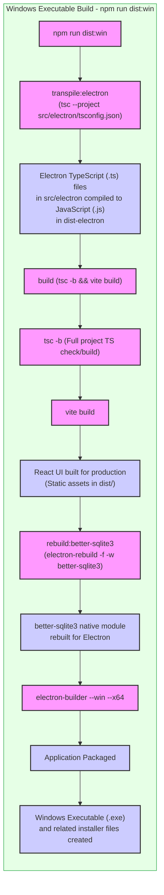

___

<h1 align="center">RexMax Specifications</h1>

> [!NOTE]
> This document has been anonymised in order to comply with the customer's demands regarding the publication of source code and documents on a publicly-accessible repository. All this redacted information WILL however be revealed during presentation for a better context. Thank you in advance for your understanding.

> [!CAUTION]
> Viewing this document in dark mode might produce unreadable mermaid diagrams, it is therefore recommended to view it in light mode.

___


<details>
<summary><em>Click to expand table of contents...</em></summary>

- [A) Introduction](#a-introduction)
  - [1) Document Purpose](#1-document-purpose)
  - [2) Project Overview (Why)](#2-project-overview-why)
  - [3) Project Roles (Who)](#3-project-roles-who)
    - [Stakeholders](#stakeholders)
    - [Explanation of the roles](#explanation-of-the-roles)
  - [4) Project Methodology (How)](#4-project-methodology-how)
  - [5) Project Plan (When)](#5-project-plan-when)
    - [Planning](#planning)
    - [Milestones](#milestones)
  - [6) Project Deliverables (What)](#6-project-deliverables-what)
- [B) Business Requirements](#b-business-requirements)
- [C) User Research](#c-user-research)
- [D) Functional Requirements](#d-functional-requirements)
  - [MoSCoW Feature Analysis](#moscow-feature-analysis)
  - [Must Have Use Case Analysis](#must-have-use-case-analysis)
  - [Should Have Use Case Analysis](#should-have-use-case-analysis)
  - [Could Have Use Case Analysis](#could-have-use-case-analysis)
- [E) Non-Functional Requirements](#e-non-functional-requirements)
  - [Costs](#costs)
  - [Reliability](#reliability)
  - [Response/Performance](#responseperformance)
  - [Delivery](#delivery)
  - [Maintainability](#maintainability)
  - [Security](#security)
  - [Compliance & Legal](#compliance--legal)
  - [Data Integrity](#data-integrity)
  - [Accessibility & Usability](#accessibility--usability)
  - [Interoperability](#interoperability)
  - [Extensibility & Configurability](#extensibility--configurability)
  - [Localization](#localization)
  - [User Experience](#user-experience)
- [F) Functional Specifications](#f-functional-specifications)
  - [1) Wireframes](#1-wireframes)
  - [2) Sequence Diagrams](#2-sequence-diagrams)
  - [3) Acceptance criteria list](#3-acceptance-criteria-list)
  - [4) Column Mapping](#4-column-mapping)
- [G) Technical Specifications](#g-technical-specifications)
  - [Technology Stack](#technology-stack)
    - [1. Microsoft Power Apps + Power Automate + Dataverse](#1-microsoft-power-apps--power-automate--dataverse)
    - [2. WinDev](#2-windev)
    - [3. NET (C) WinFormsWPF + SQLite + C MLNET](#3-net-c-winformswpf--sqlite--c-mlnet)
    - [4. Electron + Vite + React + TypeScript + TanStack + Vitest + Python ML](#4-electron--vite--react--typescript--tanstack--vitest--python-ml)
    - [5. Final Stack Choice](#5-final-stack-choice)
  - [High-Level Architecture](#high-level-architecture)
    - [Electron Architecture](#electron-architecture)
    - [Layered Architecture](#layered-architecture)
    - [Services-oriented](#services-oriented)
    - [Clean Architecture](#clean-architecture)
    - [Dependency Injection](#dependency-injection)
    - [Functional Programming vs. OOP](#functional-programming-vs-oop)
  - [Modules](#modules)
    - [Module Map (Back-end)](#module-map-back-end)
    - [Module Map (Front-end)](#module-map-front-end)
    - [Authoring guidelines](#authoring-guidelines)
  - [Data Design](#data-design)
    - [Back-end types & interfaces](#back-end-types--interfaces)
    - [Front-end types & interfaces](#front-end-types--interfaces)
    - [Export CSV](#export-csv)
    - [History CSV](#history-csv)
  - [Algorithm Selection](#algorithm-selection)
  - [Security Design](#security-design)
    - [Attack Thread Model](#attack-thread-model)
    - [Security Architecture](#security-architecture)
  - [Build & CI/CD Pipeline](#build--cicd-pipeline)
    - [Building](#building)
    - [NPM run dev](#npm-run-dev)
    - [NPM run dist:win](#npm-run-distwin)
    - [CI/CD Pipeline](#cicd-pipeline)
- [H) Quality Assurance](#h-quality-assurance)
- [I) Management Analysis](#i-management-analysis)
  - [General organisation](#general-organisation)
  - [Notes on the communication with Stakeholders](#notes-on-the-communication-with-stakeholders)
  - [Notes on AI methodology](#notes-on-ai-methodology)
  - [Risk Management](#risk-management)
  - [Failures](#failures)
- [J) Future Improvements](#j-future-improvements)
- [Glossary](#glossary)

</details>

___

# A) Introduction

### 1) Document Purpose

The goal of this document is to bring together every stage of thinking and decision-making behind RexMax into a single source. It aims to define the project as clearly and unambiguously as possible, while also tracing the data, reasoning, and choices that shaped that definition.

Because I am both project owner and sole developer, I’ve merged what you’d normally find across multiple reports: UX research, business-requirements analysis, functional, technical details, testing activity as well as management artefacts into one comprehensive document intended for the Jury and myself.

I hope that you find it informative, and that you enjoy your read.

### 2) Project Overview (Why)

> [!IMPORTANT]
> Reading the project charter located in the same folder could help gain additional context, as it is the document that served as a contract between I, the project owner, and the customer.

RexMax is the name I have given to this project: an application, destined to solve a problem that are currently facing store owners of a home improvement franchise abroad, in Mauritius Island.

As every store does, it has to manage its inventory and its supply carefully if it wants to avoid shortages and surpluses, which are both situations that cost a lot in their own ways.

This consideration for the supply chain is even more salient in islands like Mauritius, where goods can take from 3 to 6 months to arrive by boat, leaving no room for improvisation and reactivity.

Therefore, in these parts of the world, replenishers[^1] have to manage the inventory very speculatively, to anticipate seasonality, shortages, price increases, geopolitical problems.. and even import duties increasing!. Any mistake might leave the shop empty for several months.

Also, as the number of shops in the franchise, grows, it makes more and more sense to centralise such functions to all shops to take advantage of economies of scale and whatnot.

As this centralisation is being undertaken, software is needed to consolidate all the orders of different shops, for instance, so that they can altogether reach the minimum of order imposed by suppliers, fill an entire container to save on shipping costs, or just regroup orders to maximise their buyer/negotiating power.

This software, which we will call Reorder Level[^2], has been developed internally by The Company[^3], who solicited me to help them with issues they have been facing with the deployment of that very software.

RexMax is my answer to their problems, and this is what this document will explore.

### 3) Project Roles (Who)

#### Stakeholders

| Developer/Project Owner | User/Supervisor | Validator | Consultants | Secondary Users |
|---|---|---|---|---|
| Mathis KAKAL (Me) | Storemanager-A | CEO | Storemanager-B, Storemanager-C, Accountant | *other store manager  assistants* |

#### Explanation of the roles

- **Developer/Project Owner**

    - This is me, I am in charge of developing the project on my own, with the help of all the other stakeholders.

- **User/Validator**

    - This is my only end user for this iteration. "Storemanager-A" is the store manager of Store A. Store manager translates to *Responsable d'exploitation* in french, shortened to *"Rex"*, hence "RexMax". This user is also the validator of my work, as it must be tailored to them. I am in a tight feedback loop with them. They give their approval for minor to medium changes.

- **Validator**

    - This is the company's CEO, who wants to follow closely the progress of the mission with weekly meetings. They are accountable for this mission, and gives approval for major changes.

- **Consultants**

    - These are other store managers, who are also concerned with the problem, but to a lesser extend. They will be next to adopt the software and give feedback on it. They are consulted to get another point of view on the workflow a store manager is supposed to have. This allows me to anticipate future needs, and to work towards process uniformity which helps with the centralisation desired by The Company.

- **Secondary Users**

    - These are the assistants and related functions, who might have to use the software at some point because as stores are open 7 days a week, people change seats often. They are consulted for minor adjustments, global understanding and context. They are usually informed of major changes and decisions

### 4) Project Methodology (How)

> [!NOTE]
> This part has already been covered in the project charter. It is also here for accessibility.

30 days of learning, of which:

- 8 days of professional training on supply chain and inventory management,

- 5 days of machine learning courses,

- 14 days of autonomous learning on supply chain and inventory management.

- 3 days at the SITL (International Logistics Convention) to understand the state of the art in logistics and supply chain.

Then, 1 month of exploration/discovery,

1 month of development (until June 20th) in 6 sprints of one week each, days of 10 a.m. until 7 p.m., 6 days a week. Due to stakeholder availability, only one sprint meeting will be held per week, which will summarise previous week achievements, and goals for ongoing week.

2 weeks of alpha testing (only one user).

6 months of beta testing (with at least a full day of development per week)

Full release by January 2026, (all it means is that further interventions won't be part of the "package").

Util then, a same day answer to requests, and same week intervention for less important tasks, but up to same day intervention for more urgent ones.

### 5) Project Plan (When)

> [!NOTE]
> This part has already been covered in the project charter. It is also here for accessibility.

#### Planning


#### Milestones

| Milestone | Date |
|---|---|
| Project Kickoff: | 2025-04-14 Mon |
| Stakeholder alignment meeting: | 2025-04-29 Tue |
| Project Charter approval meeting: | 2025-05-08 Thu |
| Sprint Meeting 1: | 2025-05-16 Fri |
| Sprint Meeting 2: | 2025-05-19 Mon |
| Sprint Meeting 3: | 2025-05-26 Mon |
| Sprint Meeting 4: | 2025-06-02 Mon |
| Jury Version Delivery | 2025-06-08 Sun |
| Sprint Meeting 5: | 2025-06-09 Mon |
| Sprint Meeting 6: | 2025-06-16 Mon |
| MVP[4] Delivery, begin Alpha Tests: | 2025-06-20 Fri |
| Begin Beta Tests: | 2025-06-30 Mon |
| 1.0.0 Full Release Delivery: | 2025-12-31 Wed |

### 6) Project Deliverables (What)

| Name | Type | Deadline | Goal | Link |
|---|---|---|---|---|
| Project Charter | Document (markdown) | May 8th, 2025 | This document aims to ensure alignment with stakeholders and agree on the problem to tackle, high level objectives, methodology and planning, prior to developing the actual solution. | |
| RexMax Specifications (this document) | Document (markdown) | June 8th, 2025 | This document aims to provide insights on the whole thought and development process of the product. | |
| RexMax Jury Version 0.1.0 (App foundations) | Code Repository | June 8th, 2025 | Provide the foundation of the program for it to be assessed by the jury. | |
| RexMax Alpha Version | Binary Executable | June 20th, 2025 | Provide the MVP of the app, which will kickoff alpha testing. | |
| RexMax Beta Version | Binary Executable | June 31st, 2025 | Provide the version of the program which willl be battle tested in the crucial period of July. | |

# B) Business Requirements

I was first contacted for this mission in end of February 2025, when I didn't have yet the opportunity to come to Mauritius, so I used that time to learn about supply chain management, inventory management and logistics in general.

Upon arriving for the project kickoff, on April 14th, 2025, I decided to use half of my time in Mauritius to meet all the stakeholders, the end users, the validators and consultants in order to get as much context as I could for this mission, and this proved very insightful as it allowed me to completely reframe the project as explained below.

The original problem statement for this mission actually came from an audit conducted by the headquarters of The Company, based in France. They listed a number of issues, and most of them were related to shortages and all the negative consequences they have on the finances of a store.

More specifically, the tool **developed internally** "Reorder Level" to **group orders and prepare them before approval**, a process that was very lengthy before being automated **malfunctioned**, and had **burned through the store's entire annual budget in less than four months**.

Why was this tool developed internally while all the other tools were developed by an IT company responsible for the ERP[^4] the database and and the points of sale? The reason is quite interesting, actually: The Company had found out that this same IT company had been giving all the improvements requested (and paid for) by them, freely to their competitors.

This created a **climate of distrust**, and it's at this time that it was decided the that tool would be developed internally as a dynamic Excel spreadsheet as there are already many of them, in order to maintain the competitive edge over competitors.

After interviewing the author of the tool and all of its users, I realised that there were **several problems surrounding the software**, but **none inherently due to the software**. In fact, I believe that the software is actually very good at doing what is meant to do, and I am impressed that an Excel spreadsheet can succeed in achieving this complex task, and that people working in the accounting department are actually great programmers! (even though, they are using Excel...).

To be frank, given the time that I have (little under a month of development until presentation deadline), I am glad that I don't have to tackle this problem, because I still want to deliver something auditable for my presentation, even though disappointing The Company would be a worse outcome to me, as I can attempt presenting my project again later too, and I would like to keep on working for them.

Anyway, **the source of the problem was elsewhere**: the data being fed to this "Reorder Level" order management program. Indeed, there was a drawback to developing the software in house: it is that no one has ever created, nor deployed software before, and **the problems were** in fact, **due to its deployment**.

According to user interviews I conducted with stakeholders and users, at **no point in time**, was it pedagogically **made clear, or anticipated**, that this software, while automating a tedious task for several people, **actually created more strain for specifically one person**: the store manager.

The "Reorder Level" algorithm requires frequent reviews of minimum and maximum order thresholds for each SKU[^5] in the store, which is between 10 000 and 30 000 items. (depending on the context). All items have a lifecycle: new items generate more sales, therefore require a bigger safety stash in inventory while other items are about to be discontinued, and need to have their ordering thresholds lowered based on many criteria as well (those are just two basic examples).

The cyclic nature of items means that for the "Reorder Level" program to function optimally, minimum and maximum thresholds have to be manually reviewed several times a year. Considering that there are two seasons in Mauritius, summer and winter, and that they do provoke different buying patterns, that would mean reviewing at least twenty thousand SKUs every year.

This would have been the job of the replenishers previously as they were tied to specific stores, but as they have been moved up to an interstore role (they are now specialised by product categories, not stores), this task is now in the hands of... the store manager, who, you probably guessed it, is already very busy.

And this is where all the problem lies. **We have an algorithm allowing the company as a whole to be perform better thanks to economies of scale**. We also have **buyers**[^6]**/replenishers** that can now **spend more time finding better products and drive their decisions on actual data they have time to read**, but **now, store managers are overwhelmed with reviewing and adjusting Min/Max thresholds for several tens of thousands of items**, and they **didn't anticipate that** as they **weren't included in the development of this system**.

This is when I started researching about this Min/Max[^7] adjustment problem, and started wondering if my solution could revolve around this problem instead.

And I found out that it was indeed possible to **accelerate and ease this adjustment process through software**, that the **stakeholders** and **end users** **found that idea desirable**, and that, according to my estimations, it was actually feasible to do so in the little time I have (production-ready software by July 1st, 2025).

# C) User Research

A total of 31 meetings have been conducted with a total of 18 people.

Some meetings were prepared with closed questions while most of them were open-ended, and aimed at collecting as much information about the current processes and other hidden causes that could hinder The Company's efforts as I could.

Each meeting was followed with a consolidation session for me to extract all the useful information, proofread my notes, and prepare the next meetings.

During my initial Discover & Define[^8] phase which took half of my time here in Mauritius, I basically spent half of the time in meetings, and the rest of it searching for existing solutions and technologies, without engaging in any of them to avoid being to biased when deciding which path I was willing to take.

Most of the information gathered in those meetings is synthesised in the section above and distilled throughout this document, however, I specifically asked the most important stakeholders and end users what they believed the success criteria were for my mission, in order to ground my work in evidence and be able to measure success along the way.

Listening to the users and collaborators was done to the extent that I can safely say that 99% of the product originates from them. In fact, only 2-3 features which come from the realm of gamification, which they had never heard of, actually came from me. All the rest was co-created with my collaborators, with ideas coming essentially from them. This was unintended at first but seeing the positive effects of listening actively the whole time, only speaking to spark a conversation, and to facilitate emergence of new ideas proved to be extremely insightful. I can confidently say that this approach will help a lot with the adoption of the product.

<details><summary>Raw Verbatims</summary>

**Success Criteria – Storemanager-A**

> Provide him with a tool that feels reliable for placing orders and gives him confidence in what he is ordering.

> Make year-end a success: the 1,000 best-selling SKUs should no longer be an issue, and the 40 permanent families plus 15 seasonal ones should run smoothly.

> The ERP is currently too inflexible; we must be able to run data extractions and similar tasks, as noted above.

**Success Criteria – Storemanager-B**

> Mathis, our key indicator will be the stores’ stock-out rate across all items—and especially within the top 1,000 (or even top 100) products.

**Success Criteria – Storemanager-B-Assistant**

> In my view, success means the database correctly applies the recalculation of min-max adjustments.

> I’m checking this point with Storemanager-A so I can give you an answer fully aligned with him.

**Success Criteria – Replenishment Team**

> When they start using the software, they should feel at ease with it.

> The new tool must make their work more efficient.

**Success Criteria – Buyer Team**

> Above all, reduce the stock-out rate! The controlling team supplies this metric.

> We cannot afford stock-outs, especially on strategic SKUs that follow the 20/80 rule (20 % of items generating 80 % of revenue).

> This requires accurate knowledge of monthly sales (VMM = average monthly sales) and strict consideration of lead times (currently 3–4 months).

> The challenge: we still experience too many stock-outs—even on best-sellers—making monthly-sales analysis unreliable and complicating forecasts. That’s the core of the issue.

> Increase revenue (sales turnover).

> Reduce the number of items found during physical stock-out checks.

> Qualitative KPI: user teams understand how our min-max-based replenishment system works, leading to smoother supply processes.

> Quantitative KPIs:
> Zero (or minimal) stock-outs on 20/80 SKUs.
> Optimal overall stock-out rate.
> Optimised ordering: higher order frequencies/quantities but lower total order value.

___

</details>


There are five main categories emerging from those comments/requests:

- **Stock-out reduction & availability**

- **Tool ease-of-use & user confidence**

- **Data flexibility & analytical power**

- **Optimised ordering & financial impact**

- **End-of-year milestones**

**Stock-out Reduction & Availability**

*Across nearly all roles, eliminating product shortages is the dominant success signal.*

| *Desires* |
|---|
| Storemanager-B and the The Buying Team want the global *stock-out rate* tracked and driven as low as possible, with special focus on the top-100 / top-1 000 SKUs and the 20 / 80 “strategic references.” |
| The Buying Team also wants a quantitative KPI[^9] of “no (or very few) stock-outs on 20 / 80 items” plus an overall optimal stock-out rate. |
| Storemanager-A frames year-end success as making sure the 1 000 best sellers and 55 key families “are no longer problematic.” |

**Tool Ease-of-Use & User Confidence**

*Several stakeholders judge success by how the replenishment teams *feel* when they sit in front of the application.*

| *Desires* |
|---|
| Storemanager-A wants a tool that reassures the buyer that the order they are placing is correct. |
| Replenishment staff define success as “feeling good with the software” and finding that it genuinely streamlines their daily work. |
| The Buyer Team sets a qualitative KPI: user teams fully understand the min/max logic and experience smoother processes. |
| Storemanager-A wants a tool that can help them achieve this task for which the current ERP system is absolutely not optimised. |

**Data Flexibility & Analytical Power**

*A recurring pain point is the rigidity of the existing ERP system.*

| *Desires* |
|---|
| Storemanager-A explicitly cites the need for flexible extractions and ad-hoc analysis. |
| Storemanager-B-Assistant criterion is the database’s ability to recalculate and store adjusted min/max levels automatically, tying into the same demand for dynamic data handling. |

**Optimised Ordering & Financial Impact**

*Stakeholders also expect measurable business benefits beyond availability.*

| *Desires* |
|---|
| The Buyer Team wants “orders that are larger in quantity but lower in total value,” signalling better optimisation of cash tied up in inventory. |
| The Buyers also add “increase turnover” and “fewer items flagged during physical stock-out checks,” both direct financial KPIs. |

**Timelines & End-of-Year Milestones**

| *Desires* |
|---|
| Only Storemanager-A explicitly links success to a time box: “make the end of the year a success.” While not echoed verbatim elsewhere, this deadline underscores the urgency felt by the business side and may need to be formalised in the project plan. |

Those insights will impact both functional requirements, non-functional requirements, as well as the overall methodology, and they will be crucial to keep in mind when converging to a solution.

> [!IMPORTANT]
> It is important to keep in mind that the improvement of the ordering process will only have visible effects in 3-4 months (because of shipping times), at the end of the year, which is why this mission will last until January 2026.

# D) Functional Requirements

Before starting analysing the requirements and subsequent use cases, let's first enumerate all the constraints this project has, as they are actually quite heavy.

| **Constraints** | **Possible Mitigations** |
|---|---|
| Cannot ask the usual software company to develop the software because of a degraded trust. | Develop in-house. |
| There is no internal IT staff in the company, everything is externalised. Most requests take > 1 week to process and costs back-and-forth time and money. | Develop in-house by an external consultant, leverage only existing infrastructure. |
| Existing infrastructure consists of a licensed 3rd-party obscure implementation of HFSQL (WinDEV)[^10] with custom drivers to connect to it through ODBC[^11]. Drivers[^12] are signed to gatekeep access to db. | Use only company laptops, which all have this signed driver installed to operate the program. App won't work without reverse engineering the driver or resolving trust issues with 3rd party software maker. |
| Existing database is slow, and usually takes one minute to initiate a connection. (However once connection is established, CPU intensive queries run fine). | People are used to long loading times. They are also used to in-house dynamic excel files that take 1 min to load but run smoothly after. The program could replicate the same behavior, sync the data once a day, and work with that set throughout the day. (There is no more granular than the previous day's extraction anyway) |
| Database integrity is key and therefore such a program's output HAS to be reviewed by the Database Manager (Company rule), who would integrate it themselves (no write access to db). | Generate an excel/csv file instead of writing changes directly. |
| Database is inaccessible after closing times for "Maintenance" and "Extractions". | Plan any work related to the DB during work hours and all the rest outside work hours. |
| Internal Network and even cloud services are fairly slow and unreliable | Favor local processing. |
| The MVP has to be up and running for mid June (for two weeks of testing) and real production work starts on July 1st. | These are very tight deadlines, leaves me little over a month for development, including the two weeks of testing. Architecture and technology choice has to be spot on and careful AI delegation has to be used. Will probably not work in TDD mode[^13] for time savings, and will implement unit testing later and jump to end to end tests from the get-go. I also have to arbitrate between the academic quality of my work, and its actual mission effectivity. The two are not contradictory, but aren't completely aligned either. |

We now know that we need to develop an application in one month, that aims to ease the process of adjusting Min/Max for the Storemanager-A. We know that it should not saturate the network more than it already is saturated and that it will sync the database locally once a day (like the company already does with its excel spreadsheets) instead of making multiple requests to the live DB.

As noted earlier in the user research pain points, this process is technically already feasible, but requires advanced searching and filtering, switching between windows and models, and relying on an app that runs in a slow virtual machine. From one of my user interviews I noted that this created a lot of friction and completely discouraged the store managers from doing this task. (Along with not being instructed that it had to be done when "Reorder Level" was rolled out, of course.)

I could hypothesise from this that a good starting point would be an app that solves this accessibility of data issue. This app should gather everything  the user needs to adjust their thresholds in one place, with as little friction as possible (because there could be a hundred adjustments to make at once!).

After validation of this initial idea, the stakeholders and I compiled a table of features prioritised by importance thanks to a MoSCoW analysis[^14]. Here are the high-level features of the product, after several weeks of meetings and brainstorming, and that were approved by the mission supervisor:

## MoSCoW feature analysis

| Must Have | Should Have | Could Have | Won't Have |
|---|---|---|---|
| • Application for setting minimum and maximum order thresholds that allows to look at the most store manager's preferred data to make informed decisions for each SKU. [UC-01], [UC-02] | • System provides actual adjustment recommendations (increase or decrease) [UC-09] | • Data visualisation on select/most important metrics to ease the eye. The goal is to allow to make quicker judgments and having less eye fatigue at the end of the day. [UC-13] | • Complete ERP suite that would fix problems tied to the current one. |
| • No automatic proposition for adjusting the thresholds, but detection of the necessity to adjust them, based on 4 scenarios : Surplus, Sales improvement, New product, Shortage alert. [UC-01], [UC-03] | • Have an history of all the past decisions to be able to improve judgment over time (and train an ai afterwards) [UC-10] | • Ability to authentify users, allowing for role based access control.  [UC-14], [UC-15] | • Tackling infrastructure problems (underpowered server, synchronous nature of apps which doesn't go well with the overall latency, network/VPN problems etc.) |
| • Displayed SKUs will be a restrained to a specific subset of all store SKUs: Only SKUs for store A, of which only those who come from European suppliers, of which only those that represent the 20% in quantity that make up 80% of the sales in quantity, of which only the articles that are in "Permanent" or "New" mode, as the other modes don't require automatic resupplying. This amounts to ~~1000 SKUs. [UC-01], [UC-04] | • Notify resuppliers automatically of any threshold changes, once a week. [UC-11] | • "Duolingo mode" Automatic sorting of SKUs by importance, by weighing different criteria. SKUs would be sorted by most urgent first, and users would only have to take care of the first items to always be working on what is important.  [UC-16] | • AI-powered solution that takes automatically sets the thresholds. |
| • Generates an excel file in Min/Max format, so that it doesn't disrupt the current threshold updating process, which is crucial to ensure database integrity. [UC-05] | • Improvement of search to include all or most relevant data [UC-12] | • Customising the interface (once testing has extended to other store managers) to take into account different methodologies. [UC-17] | • Solution that is adapted to all of the Stores upon initial releases. |
| • Basic column sorting (ascending or descending) and search by SKU and supplier. [UC-06], [UC-07] | | • Gamification elements, such as notifications/reminders and "visual accomplishments feedback" to encourage averaging out the setting of the thresholds throughout the year, rather than all at once. [UC-18] | |
| • Config-based interface, however, no config tool, therefore interface isn't customisable yet. [UC-08] | | • Built-in feedback form to support the rapid iteration process and to allow users to directly submit tickets for feature improvements, bugs or simple requests through the app interface. [UC-19] | |

## Must Have Use Case Analysis

| Use Case Number & Name | Description | Actor(s) | Pre-Conditions | Flow of Events | Post-Conditions | Exit Criteria | Notes & Issues |
|---|---|---|---|---|---|---|---|
| [UC-01]: Open the application to the main screen. | Store Manager opens the app which loads the default data table, which contains all the data needed to make informed adjustments. | Store Manager | Basic configuration is loaded, Network to DB is up, (VPN is connected if working remotely) | 1. Launch app or click the "**Données**" pane/tab; <br><br>2. System loads last-used filter and column set; <br><br>3. System queries DB for the SKU subset;<br><br>4. Table renders with preferred columns and default sort. | Table with ~1 000 SKUs is visible; Applied filter and column profile cached for next session | User navigates to another screen OR closes application | Here is the basic column list, as asked by the final user:<br><details><summary>Column List</summary><br>"Référence Produit"<br>"Description du Produit"<br>"Marque du Produit"<br>"Référence du Produit Fournisseur"<br>"Code Barre"<br>"UOM"<br>"PCB"<br>"Dernier Prix d'achat"<br>"Devise Dernier prix d'achat"<br>"Nom Fournisseur"<br>"Catégorie"<br>"Famille"<br>"Sous Famille"<br>"Rayon"<br>"Sous Rayon"<br>"Commentaire"<br>"Opération"<br>"Total Ventes mois m-13"<br>"Total Ventes mois m-12"<br>"Total Ventes mois m-11"<br>"Total Ventes mois m-10"<br>"Total Ventes mois m-9"<br>"Total Ventes mois m-8"<br>"Total Ventes mois m-7"<br>"Total Ventes mois m-6"<br>"Total Ventes mois m-5"<br>"Total Ventes mois m-4"<br>"Total Ventes mois m-3"<br>"Total Ventes mois m-2"<br>"Total Ventes mois m-1"<br>"Ventes Moyennes Mensuelles"<br>"Couverture Stock"<br></details><br><br>Please refer to "Column Matching" Appendix to match display names and actual names as found in database. |
| [UC-02]: Set Min/Max Thresholds | Edit and save new minimum and maximum stock levels for a chosen SKU. | Store Manager | UC-01 table is displayed; User has “Min/Max” role. | 1. Press a button (for instance, SPACE) to switch from the "**Données**" tab to the "**Min/Max**" tab, which keeps the same SKU order but displays different columns (see list on the side); <br><br>2. Tab/Pane shows different columns for the same items as filtered in the "**Données**" pane, but with different columns; Scroll position has to be preserved to maintain illusion that the same SKUs are being referenced. <br><br>3. User checks old values, enters new values and presses **✅** to send add the changes to the list of adjustments or ❌ to tell the system that modifying the min max value isn't necessary for this SKU and pop it off the list.; <br><br>4. User will now find all the approved changes in the "**Export**" tab, along with an export button, which will print out all the changes in the company's usual csv format. (see note aside) | Thresholds updated; Audit log entry with user, time, old and new values. | Values saved successfully **or** user presses **Cancel**. | List of columns:<br><details><summary>Column List</summary><br>"Référence Produit"<br>"Min actuel"<br>"Max actuel"<br>"Nouveau Min"<br>"Nouveau Max"<br>"Raison pour le changement"<br>"Approbation du changement"<br></details><br> |
| [UC-03]: Detect Need for Adjustment | Launch job flags SKUs that meet any of four alert scenarios (Surplus, Sales increase, New Product, Shortage). | System (at app launch, analysis is performed) | UC-02 is implemented; | 1. User opens the app for the first time of the day.<br><br>2. After fetching the latest data and the configuration, app performs analysis locally to fill the "**Raison pour le changement**" column with either of 4 scenarios: Surplus, Sales increase, New Product, Shortage)<br><br>4. All items that fit one of those four conditions will be automatically moved to the beginning of the list, to give a sense of priority over non-urgent items.<br><br>5. Reasons are displayed in the "**Min/Max**" pane, and it is clear that shortages are pushed to the top as most urgent SKUs to adjust. | Alert list contains SKUs needing review; Scenario flag visible in UI; | Job finishes analysis without error (success or recoverable failures logged) | For now, we can give an urgency score as follows: Shortage = 4, New product = 3, Surplus = 2, Sales Increase = 1, All the rest of SKUs = 0 by default. List should be sorted by descending order. |
| [UC-04]: Filter SKU pool | Apply or modify multi-criteria filter (Store A + EU supplier + 20/80 + Permanent/New). | System | UC-01 Open | 1. This global filter, applied by the system on database fetch, is not customisable by the user. However since it will be later on, display the filters as chips in sub ribbon as greyed out, so that the user knows they can't be removed. | App only loads subset that meets filter; | Data loaded succesfully without errors. | Here is the default filtering to ensure displaying the most relevant SKUs: <br><br>Of all the SKUs of all the stores, display only those of "Store A", of which display only the "A" category in sales quantity (basically the 20% of SKUs that make up 80% of sale volumes), of which only those that come from "EUROPE" supplier types (longest delivery times), of which only those that are flagged "Permanent" or "New" as "lifecycle status". This should yield the most critical 1000-3000 SKUs which is the agreed upon starting point for this iteration of the product. |
| [UC-05]: Export Thresholds to Excel | Export to the Min/Max spreadsheet format. | Store Manager | UC-01, UC-02 and UC-03 Implemented | 1. Click **Export** tab/pane;<br><br>2. Review all the approved changes one last time to see if they match user's expectations.;<br><br>3. Click on the export button if agree or individually remove SKU adjustments by clicking the red cross next to them; | File saved on user’s computer via "*Save as*" modal; Export action logged (who, when, row count).<br> | Download completes **or** user cancels. | Placeholder title should be: `MinMax_<Store>_<YYYYMMDD>.xlsx` <br><br>Min/Max file CSV format: sku, newMin, newMax |
| [UC-06]: Sort Columns | Order rows ascending or descending by any column. | Store Manager | Table displayed | 1. User clicks column header;<br><br>2. System toggles Asc → Desc → None;<br><br>3. Table re-renders in chosen order;<br><br>4. Sort icon reflects state | Table ordered per user choice; Sort state remembered until next session thanks to configuration file. | User clicks another column **or** resets sort | Make sure the interaction is compatible with future improvement : drag-n-drop-able columns to reorder them. |
| [UC-07]: Search by SKU or Supplier | Quickly isolate rows matching typed text. (One filter at the time) | Store Manager | Requires UC-04 and UC-01 | 1. Click search box and type query;<br><br>2. Depending on the string format provided (text or only numbers) search will automatically search either indexed supplier field or SKU field for matching items and will apply a global filter on the table.; <br><br>3. Table is filtered to show only that supplier or only that reference<br><br>4. Supplier clears the filter by clicking the filter chip cross below the ribbon (along the UC-04 global filters) | Table shows only matching rows (zero or many); No search history for now. | User clears search field, or search filters **or** navigates away | Search should be < 2s for any supplier or reference, UI should be minimal to suggest very minimal functionality for now. |
| [UC-08]: Load Config-Based UI | Build and display UI components from YAML/JSON config at app start-up. | System | Valid config file found in AppData/Roaming/Rexmax; UC-01 implemented. | 1. App launches;<br><br>2. System reads default config and/or user overrides;<br><br>3. Components instantiated per schema; | UI available for interaction; | All components render successfully **or** critical error leads to fallback screen. | Add hot-reload for config in dev mode.<br>Might add config hash to logging for diagnostics later. |

## Should Have Use Case Analysis

| Use Case Number & Name | Description | Actor(s) | Pre-Conditions | Flow of Events | Post-Conditions | Exit Criteria | Notes & Issues |
|---|---|---|---|---|---|---|---|
| [UC-09]: Recommended Threshold Adjustment | Suggest new Min/Max values for alert-flagged SKUs by matching past reasons with numeric changes (simple linear regression model). | System; Store Manager | UC-03 analysis has populated the “Raison pour le changement” column; History file (CSV) of past adjustments exists; User is in the “Min/Max” tab. | 1. User navigates to the "**Min/Max**" tab/pane.<br><br>2. System retrains the regression model built from historical file.<br><br>3. Model outputs suggested Min and Max for the selected reason tag and fills the New Min and prefills New Max columns for each SKU (previously empty).<br><br>4. User assesses these suggestions.<br><br>5. User may still press ✅ to accept or  ❌ to reject SKU altogether, or may now press ✏️ to edit numbers if algorithm is only "off by a little". | If accepted: thresholds updated and logged in the adjustments list; If discarded: no change. | User accepts or discards suggestion **or** closes the modal. | Model retrained each time the app is opened. Overhead would be in < 100ms anyway. |
| [UC-10]: Open Decision-History File | Allow user to open the external CSV log of all past threshold decisions. | Store Manager | History CSV exists in the app’s export folder; Default system handler for “.csv” is set. | 1. User clicks "**Historique des Ajustements**" button in ribbon.<br><br>2. App calls OS “open file” command on the CSV path.<br><br>3. Operating system launches the default spreadsheet editor with the file. | CSV opens in external app; User can inspect, filter, or save a copy. | User closes the external application or returns to the main app. | |
| [UC-11]: Weekly Threshold-Change Notification | Prepare a pre-filled email draft listing all adjustments made during the past week. | Store Manager | At least one approved adjustment exists in pending adjustments (a.k.a. "**Export**" tab/pane; Default email client installed (All company has outlook mail configured). | 1. User clicks "**Notifier Acheteuses **"<br><br>2. App compiles change list into plain-text table.<br><br>3. App triggers a `mailto:` URI with subject “Min/Max weekly digest <YYYY-WW>” and body containing the table.<br><br>4. OS opens default mail client with draft ready. | Email draft visible to user for review. | User sends email OR closes draft unsent. | Add recipient list to config file. (The Replenishers and The Buying Team)<br><br>Might move to another more robust system but this will work for now. |
| [UC-12]: Advanced Search | Search across multiple fields (SKU, supplier, category, reason tag) with AND logic. | Store Manager | “**Données**” or “**Min/Max**” table displayed; | 1. User presses "**Ctrl + F**" or clicks the same "**Recherche**" as in UC-07.<br><br>2. There are now as many search fields as there are Columns.<br><br>3. User fills one or more fields and hits "**Appliquer**".<br><br>4. App builds combined filter and refreshes table; Chips for each criterion appear under ribbon.<br><br>5. User can save query as “Favori” or clear all chips. | Table shows rows matching composite query; Criteria stored in session until app exit. | User clears chips OR closes modal. | Ensure response time ≤ 2 s for queries returning up to 3 000 rows.<br><br>For now, the advanced search will only support chaining conditions with AND logic, narrowing the results down as more conditions are added. |

## Could Have Use Case Analysis

| Use Case Number & Name | Description | Actor(s) | Pre-Conditions | Flow of Events | Post-Conditions | Exit Criteria | Notes & Issues |
|---|---|---|---|---|---|---|---|
| [UC-13]: Visualise Key Metrics | Display sales trend, stock-out frequency and other charts for the currently highlighted SKU in a right-hand sidebar. | Store Manager | Table (“**Données**” or “**Min/Max**”) is loaded; At least one SKU row is highlighted. | 1. User highlights an SKU row (arrow keys or mouse click on a row).<br><br>2. User clicks **Visualiser** in ribbon.<br><br>3. Sidebar slides in; main grid shrinks.<br><br>4. App queries in-memory data for that SKU, renders charts (<2 s).<br><br>5. User navigates SKUs with ↑ / ↓; charts update on selection change. | Sidebar shows charts synced with selected SKU; Last-used sidebar state remembered for next session. | User closes the sidebar by pressing "**ESCAPE**" OR navigates away from current tab/pane. | Keep memory footprint small; fallback to spark-lines if dataset >10 k points. |
| [UC-14]: Authenticate User | Log in via corporate SSO; cache token if “Remember me” checked. | User | Network access to Auth Server; No valid token cached **or** user clicked **Changer d’utilisateur**. | 1. Login screen appears.<br><br>2. User enters credentials (or SSO popup).<br><br>3. Server validates; returns JWT + user profile.<br><br>4. App stores token (encrypted) if “Se souvenir”.<br><br>5. App downloads user-specific config (column order, favourites).<br><br>6. Main screen (UC-01) loads. | Session token stored; User profile and config in memory. | Auth succeeds **or** user presses **Annuler**. | Token refresh silently on expiry; offline mode out-of-scope for now. |
| [UC-15]: Authorise by Role | Enforce feature access based on role claims in the auth token. | System | User authenticated (UC-14); Roles array present in token. | 1. On each UI action or API call, app reads roles.<br><br>2. If role present → allow; else → disable button / return 403.<br><br>3. Denials logged with timestamp and action name. | Only authorised features usable; Audit trail of denials. | Action permitted or blocked and user informed. | Roles: MinMax, Export, ConfigAdmin, Admin. Fine-grain rules in future. For now every user will have those anyway, since it is meant only for them. |
| [UC-16]: Enhanced Urgency Ranking (“Duolingo Mode”) | System computes granular urgencyScore per SKU (seasonality, spikes, lead-time) and auto-sorts list; encourages tackling red rows first. | System | UC-03 completed; User is on table view; “Duolingo Mode” toggle OFF. | 1. On startup, analytics module assigns urgencyScore to each SKU.<br><br>2. Scores stored in hidden column (0–100).<br><br>3. User toggles **Duolingo Mode**.<br><br>4. Table re-orders by descending score; rows with score ≥ 80 tinted red.<br><br>5. After each adjustment save, score recalculated; row colour updates. | Table always shows highest-impact SKUs first; Visual cues guide user. | User toggles mode OFF **or** closes application. | Exact scoring weights TBD;  As soon as implemented "Duolingo Mode" will be turned ON by default, and only turned off if the user is bothered by clues and knows what they are doing. |
| [UC-17]: Customise Interface by User | Store Manager creates new account and saves configuration to server. | Store Manager; System | 1. Server Master has generated an invite token for the target store/role and sent it to the user.<br><br>2. Client PC has network reachability to Auth/Config API. | 1. User clicks **Changer d’utilisateur**, then **Créer un compte**.<br><br>2. User enters *username* and *invite token* → **Valider**.<br><br>3. API verifies token, creates user record, returns JWT with `store` and `role`.<br><br>4. App downloads `store_default_config.json`; loads UI (UC-01).<br><br>5. User drags columns, sets favourite filters, saves advanced searches.<br><br>6. On app close: POST JSON to `/user_config/{userId}`.<br><br>7. Server stores blob, overwriting prior version and marks `updated_at`. | User-specific config persisted in DB.<br><br>Next login loads personalised layout automatically. | Config upload succeeds OR user cancels app exit and continues working. | **Security**: invite tokens hashed and one-time-use. Fallback: if upload fails, local copy cached and retry on next launch. |
| [UC-18]: Show Gamification Feedback | Provide streaks and gentle reminders to motivate daily threshold work. | System | App is open; UC-16 urgency scoring active; Gamification flag ON in user profile. | 1. User sees the top table rows coloured red.<br><br>2. User selects a red-row SKU to analyse its data.<br><br>3. User adjusts Min/Max and presses ✅ to approve.<br><br>4. Row is popped off the list with a brief “✔ Réglé !” animation; streak counter +1.<br><br>5. User repeats for remaining red rows.<br><br>6. When the last red row is cleared, system shows a toast “Bravo ! Tous les urgents traités” with buttons **Continuer** and **Désactiver le mode Duolingo pour aujourd’hui**. | Red-row count updated and urgency scores recalculated.<br><br>Streak value and last-cleared-date saved to user profile on server.<br><br>If a milestone reached (e.g., 10 red rows in a day), badge flag set true and badge displayed in top bar. | User clicks **Continuer**, **Désactiver**, OR closes toast.<br><br>App window closed. | Keep daily red-row quota reasonable so task feels completable; adjust thresholds after user-testing. |
| [UC-19]: Submit Feedback | Ribbon button opens chatbot that fills an issue template and posts to Git repo. | Store Manager | Network access to repo API; User authenticated (UC-14).; GitHub Api token available in config. | 1. User clicks **Feedback / Support**.<br><br>2. Chatbot side-panel opens; asks guided questions.<br><br>3. Answers populate Markdown issue template.<br><br>4. User reviews and clicks **Envoyer**.<br><br>5. App POSTs issue via repo API; receives issue URL.<br><br>6. Panel shows “Merci !” with link. | Issue created in repository; URL logged for follow-up. | User submits issue OR closes chatbot unsent. | It would be good to have a GitHub bot automatically triage the issues to be able to use the GitHub Project as an efficient Backlog |

# E) Non-Functional Requirements

> [!IMPORTANT]
> Those requirements are generally for the full release of the app, and cannot be expected from its first iterations. Iteration of the product will help build towards the following standards of quality.

## Costs

### I - Capital Expenditures

Limited to the cost of the development, as agreed in the mission contract.

### II - Operational Expenditures

None, the app will leverage existing database and network infrastructure. No additional costs.

Only GitHub could require credits for running jobs and issues API, however, current use will be covered by my student plan for at least another year.

## Reliability

| Aspect | Target / Mechanism |
|---|---|
| Mean Time Between Failures (MTBF) | ≥ 90 days (application-level crash) |
| Crash Rate | ≤ 1 crash / 5 000 user sessions |
| Fault Tolerance | Auto-retry ×3 for DB / SMTP transient errors |
| Health Monitoring | Local log + Windows Event on unhandled exception |

## Response/Performance

| User Action / Process | Requirement (95-th percentile) |
|---|---|
| App start-up (inc. DB sync) (UC-1) | ≤ 45 s on i7-4C / 16 GB / SSD / 22H2 Win 11 (target machine) |
| Sort / filter / column re-order | ≤ 1s render |
| Basic search (UC-07) | ≤ 2 s for ≤ 3 000 rows |
| Advanced search (UC-12) | ≤ 2 s composite query |
| Regression fit (UC-09) | ≤ 4 s |
| Chart load (UC-13) | ≤ 2 s |
| CSV export (UC-05, 1 000 rows) | ≤ 5 s |
| Sustained CPU | ≤ 40 % of 4-core i7 |
| Sustained RAM | ≤ 1537 MB |

## Delivery

### Alpha Version

| Item | Detail |
|---|---|
| Portable Executable + Files in temp directory | Unsigned app, |
| Update Procedure | No auto update, will notify users when they must drag and drop the new binaries in the app directory when a new update is available |

### Beta Version

| Item | Detail |
|---|---|
| Installer | Signed MSI, silent mode `/quiet` |
| Self-Update | Squirrel/Electron; manual trigger + auto on launch |

## Maintainability

| Metric / Practice | Target / Tooling |
|---|---|
| Unit test coverage (business code) | ≥ 95 % |
| Avg cyclomatic complexity[^15] | ≤ 10 / function |
| Lint/format | ESLint + Prettier |
| Docs | JSDoc + MD README per module |

## Security

| Layer | Control / Standard |
|---|---|
| Authentication | OIDC SSO[^16] → JWT[^17]; “Remember me” encrypted via DPAPI[^18] |
| Authorisation | Role claims checked client side + API enforcement |
| Invite tokens | 192-bit random, bcrypt-hashed, TTL[^19] 24 h, single-use |
| Transport | VPN + TLS 1.2 |
| Data at rest | API keys & tokens AES-256 encrypted in config store |
| Logging | No PII[^20]; rotation 10 MB × 5  (this means that the 5 last logs will be kept, and 6th one will overwrite the oldest) |
| Vulnerability mgmt | `npm audit` quarterly, critical fixes < 7 days |

## Compliance & Legal

| Domain | Measure |
|---|---|
| GDPR | Stores only username & email; no PII in exports or logs |
| Licensing | All OSS[^21] packages MIT/BSD or corporate-approved |

## Data Integrity

Data Integrity of the live Database by exporting the changes to a `csv`, which places the responsibility for the integrity of the data in the hands of The Company's database manager, as requested by the stakeholders. Therefore, the program will never have direct write access to The Company's assets, at least not before their explicit approval.

## Accessibility & Usability

| Aspect | Target |
|---|---|
| Keyboard navigation | Most important features accessible via keyboard. Selecting SKU, switching between panes and switching between cells. |
| Colour contrast | WCAG[^22] AA ≥ 4.5 : 1 |
| First-time task metric | User completes one Min/Max edit ≤ 5 min unassisted |

## Interoperability

| Integration | Protocol / Format |
|---|---|
| Live DB | HFSQL through ODBC (read/write) (subset of SQL) |
| Local Cached DB | Sqlite SQL (Standard SQL) |
| CSV export | Legacy “MinMax” schema, very basic and interoperable; History of changes in CSV as well |
| Auth | OIDC via corporate IdP[^23] |
| GitHub | REST v3[^24] issue endpoint |

## Extensibility & Configurability

The app will have to maintain a clear separation of concerns between front and back and must provide a solid foundation for later improvements as it will be developed over a year.

As described in the Functional Requirements, it will support multiple workflows and users, therefore its configuration-based nature has to be extensible to parameters that will be added along the way.

Hardcoding values must be avoided at all costs, in favor of constants file and loaded configs overwriting default configs.

## Localization

French is the only language considered for developing this app. No localisation necessary.

## User Experience

Add loading animations to every > 1s load, and progress bars to mitigate the loading times and improve user experience.

Add shimmer effect to loading UI components like table rows or graphs loading.

It has also been noted in the user interviews, that the users spend most of their day behind computers and large excel spreadsheets, which has occasionally caused eye fatigue to some of them. Extra care will be put in the UI so that the table is bigger and easier on the eyes than excel spreadsheets with smooth scrolling animations, reduced information on screen, careful smooth font choice, and font size that is larger than usual.

Dark mode will be supported.

# F) Functional Specifications

## 1) Wireframes

### Grid Layout

The main layout will use a fixed viewport that will fit to any resolution above 720p (1280x720 pixels). Below that, the app layout is not expected to render properly. The target devices always use apps in fullscreen and 1080p (1920x1080 pixels), so 1280 pixels minimum width should allow some room for viewing a slice of another window/desktop.

The main content block  has an all around margin of 2%, while the rest of the content is described as follows:


### Main Screen "Données"

This is the main screen upon loading the app


### Secondary Screen "Min/Max"

This screen is where the adjustments are actually made (or suggested adjustment approved depending on implementation of recommendation engine)


### Tertiary Screen "Export"


## 2) Sequence Diagrams

### App launch sequence [UC-01] to [UC-08]

> [!NOTE]
> UC-09 onwards actually modify existing sequence as they are new "layers" or development and refinement.  The following only applies to that first stage of development (UC-01 to UC-08)



### Scenario Detection System [UC-03]



### Linear Regression Min/Max Adjusting System [UC-09]

> [!NOTE]
> This whole procedure is appended to the previous launch sequence, as is also the case for other "Could Haves" and "Should Haves" UCs



## 3) Acceptance criteria list

> [!TIP]
> The goal of the acceptance criteria are to explicitly state what is expected from a successful implementation of the Use Cases, thanks to a "Given" => "When" => "Then" framework. This is the foundation of clear testing and it help bring requirements even further into the realm of specifications.  

### UC-01 - Open the application to the main screen

| ID | Given | When | Then |
|---|---|---|---|
| AC-01-1 | Fresh launch (no local DB) | App starts | Splash screen stays ≤ 45 s and grid renders ≥ 1 000 SKUs. |
| AC-01-2 | User closed app with a custom column order last session | App restarts | Same column order and filter chips are applied automatically. |
| AC-01-3 | Server is down (three failed attempts to connect) | App starts | App gracefully crashes with "Le serveur n'a pas pu être atteint, veuillez vérifier votre connexion au réseau, ou au VPN si vous êtes à distance.". |

### UC-02 - Set Min/Max Thresholds

| ID | Given | When | Then |
|---|---|---|---|
| AC-02-1 | Données pane focused | SPACE pressed | Min/Max pane opens, scroll position unchanged, keeps the highlighted row the same. |
| AC-02-2 | NewMax inferior to NewMin entered | ✅ clicked | Cell outlines turn red, toast **“Max doit être ≥ Min”**, change not saved. |
| AC-02-3 | Valid Min & Max entered | ✅ clicked | Row appears in Export tab and audit log line contains **oldMin, oldMax, newMin, newMax, username, timestamp**. |
| AC-02-4 | User presses ❌ on a pending change | — | Row disappears from Export tab; original values restored in grid. |

### UC-03 - Detect Need for Adjustment

| ID | Given | When | Then (tag / score) |
|---|---|---|---|
| AC-03-1 | App launches and snapshot load succeeds | Analysis completes | Each SKU that meets any rule below displays the corresponding tag in **« Raison »** and receives an **urgencyScore** (see below). |
| AC-03-2 Shortage | On-hand Stock ÷ Avg Monthly Sales < **3** | — | Tag = *Shortage* and urgencyScore ≥ 80 |
| AC-03-3 Surplus | Days-since-Last-Sale ≥ **180** | — | Tag = *Surplus* and urgencyScore = 20 |
| AC-03-4 New product | Status column value = **“New”** | — | Tag = *New Product* and urgencyScore = 60 |
| AC-03-5 ↑ Sales | Sum(Sales m-1…m-3) ≥ **110 %** of Sum(Sales m-13…m-15) | — | Tag = *Sales increase* and urgencyScore = 40 |
| AC-03-6 Persistence | First analysis today has run | User re-opens app same calendar day | Previously calculated urgencyScore and row order are reused (no second analysis pass) |

### UC-04 - Filter SKU pool

| ID | Given | When | Then |
|---|---|---|---|
| AC-04-1 | App starts | — | Filter chips **Store A > EU > 20/80 > Permanent/New** visible and greyed out (fixed). |
| AC-04-2 | Filter is applied | — | Row count ≤ 3 000 and all SKUs belong to Store A. |

### UC-05 - Export Thresholds to Excel

| ID | Given | When | Then |
|---|---|---|---|
| AC-05-1 | Export tab shows ≥ 1 change | Export button clicked | Save-as dialog proposes file name `MinMax_StoreA_YYYYMMDD.xlsx`. |
| AC-05-2 | Save completed | — | Toast **“Export réussi : n lignes”** and audit log entry with row count. |

### UC-06 - Sort Columns

| ID | Given | When | Then |
|---|---|---|---|
| AC-06-1 | User clicks column header | 1st click | Column sorted ascending, ▲ icon shown. |
| AC-06-2 | Same header clicked again | — | Order switches to descending, ▼ icon shown. |
| AC-06-3 | Third click | — | Sort cleared, no icon. |

### UC-07 - Search by SKU or Supplier

| ID | Given | When | Then |
|---|---|---|---|
| AC-07-1 | Text “ABC” typed | — | Rows whose *SupplierName* contains “ABC” remain; chip **Supplier: ABC** appears. |
| AC-07-2 | Numeric “123456” typed | — | Single SKU 123456 row displayed; chip **SKU: 123456** appears. |
| AC-07-3 | Chip cleared | — | Full filtered list (UC-04) restored. |

### UC-08 - Load Config-Based UI

| ID | Given | When | Then |
|---|---|---|---|
| AC-08-1 | `config.json` contains hidden column spec `["urgencyScore"]` created on the local db | App starts | Column is not visible in grid but present in DevTools data dump. |
| AC-08-2 | Config file corrupted | App starts | Fallback screen with error **“Config invalide, veuillez vérifier votre fichier de configuration”** and graceful crash. |

### UC-09 - Recommended Threshold Adjustment

| ID | Given | When | Then |
|---|---|---|---|
| AC-09-1 | History CSV ≥ 30 rows | App starts and Min/Max suggestion checkbox ticked | Suggestions populate within ≤ 5 s during main app start sequence. |
| AC-09-2 | User clicks ✅ on suggested row | — | Suggested Min/Max accepted and row moves to Export tab. |
| AC-09-3 | User edits suggested value | — | Edited numbers overwrite suggestion before acceptance. |

### UC-10 - Open Decision-History File

| ID | Given | When | Then |
|---|---|---|---|
| AC-10-1 | History CSV exists | "**Historique**" button clicked | OS launches default CSV viewer with correct file. |

### UC-11 - Weekly Threshold-Change Notification

| ID | Given | When | Then |
|---|---|---|---|
| AC-11-1 | ≥ 1 change approved this week & last notification was ≥ 6 days ago | Notifier button clicked | Outlook draft opens with subject `Min/Max weekly digest YYYY-WW` and change list in body. |

### UC-12 - Advanced Search

| ID | Given | When | Then |
|---|---|---|---|
| AC-12-1 | User fills **Fournisseur="XXX"** **Category=7** | Appliquer clicked | Grid shows only rows matching both conditions; two chips displayed. |
| AC-12-2 | Query returns > 1000 rows | — | Toast **“Résultat trop large – affinez la recherche”** and grid unchanged. |

### UC-13 - Visualise Key Metrics

| ID | Given | When | Then |
|---|---|---|---|
| AC-13-1 | Row highlighted | Visualiser clicked | Sidebar slides in ≤ 1 s; chart renders ≤ 2 s for that SKU. |
| AC-13-2 | User presses ↑ | — | Charts refresh to new highlighted SKU within 2s too. |
| AC-13-3 | User presses ESC | — | Sidebar closes and grid returns to full width. |

### UC-14 - Authenticate User

| ID | Given | When | Then |
|---|---|---|---|
| AC-14-1 | Correct credentials | Login submitted | Main screen loads; token stored encrypted. |
| AC-14-2 | “Remember me” checked | App relaunched next day | No login prompt shown (token refresh silent). |
| AC-14-3 | Bad password | Login submitted | Error **“Identifiants invalides”** displayed; no token stored. |

### UC-15 - Authorise by Role

| ID | Given | When | Then |
|---|---|---|---|
| AC-15-1 | Token lacks `Export` role | Export tab selected | Button **Export** is disabled and tooltip **“Accès restreint”** shown. |
| AC-15-2 | User with `Admin` role | Attempts same | Button enabled; action proceeds. |

### UC-16 - Enhanced Urgency Ranking (Duolingo Mode)

| ID | Given | When | Then |
|---|---|---|---|
| AC-16-1 | Mode off | Toggle switched on in "**Paramètres**" pop-up menu. | Grid re-orders so highest urgencyScore is first; rows ≥ 80 tinted red. |
| AC-16-2 | User resolves last red row | — | Toast **“Bravo ! Tous les urgents traités”** appears with two buttons. |

### UC-17 - Customise Interface by User

| ID | Given | When | Then |
|---|---|---|---|
| AC-17-1 | Valid invite token | Create account flow | New user profile saved; store_default_config loaded. |
| AC-17-2 | User reorders columns | App closed | POST `/user_config/{id}` returns 200; next login shows same order. |

### UC-18 - Show Gamification Feedback

| ID | Given | When | Then |
|---|---|---|---|
| AC-18-1 | Red row cleared | ✅ pressed | Row pops with animation and streak counter "+1" in the menu ribbon. |

### UC-19 - Submit Feedback

| ID | Given | When | Then |
|---|---|---|---|
| AC-19-1 | GitHub token valid | Feedback panel submit | Issue created; success panel shows link to issue URL. And mention "**Vous pouvez fermer cette conversation**" |
| AC-19-2 | API returns 401 | Submit pressed | Toast **“Authentification GitHub échouée”** and no crash. Close input window. |

## 4) Column Mapping

> [!NOTE]
> This is the mapping of all the columns that were requested by the end user for their "**Données**" view. 

| Display Name | Source Column / Expression | Base Table |
|---|---|---|
| Code Item | ArticlesDimUDF.articlescode | ArticlesDimUDF |
| Désignation Bricomax | ArticlesDimUDF.articlesdesc | ArticlesDimUDF |
| Code Barre | ArticlesDimUDF.BarCode | ArticlesDimUDF |
| Fournisseur Par Défaut | ArticlesDimUDF.DIM6CODE | ArticlesDimUDF |
| Nom Fournisseur | ArticlesDimUDF.DIM6DESC | ArticlesDimUDF |
| Référence Fournisseur | ArticlesDimUDF.SupplierCode | ArticlesDimUDF |
| Unité D’achat | ArticlesDimUDF.articlesUOM | ArticlesDimUDF |
| Stockable | ArticlesDimUDF.ArticlesStockable | ArticlesDimUDF |
| Vendable | ArticlesDimUDF.articlesvendable | ArticlesDimUDF |
| Actif Inactif | ArticlesDimUDF.ArticlesInActif | ArticlesDimUDF |
| Achat Interdit | ArticlesDimUDF.nopurchase (0 / 1 → CASE) | ArticlesDimUDF |
| Commentaire | ArticlesDimUDF.Dim11Desc | ArticlesDimUDF |
| Statut De Vie Produits | ArticlesDimUDF.Dim12Desc | ArticlesDimUDF |
| Coût Unitaire | ZZTempOlapStock.UnitCost | ZZTempOlapStock |
| PV TTC | PriceListArticle.PVTTC1 | PriceListArticle |
| Prix Subi | ArticlesDimUDF.prixsubi | ArticlesDimUDF |
| Dernier Prix Receptionné | ArticlesDimUDF.lastpurchaseprice | ArticlesDimUDF |
| Dernier Fournisseur Réceptionné | ZZTempOlapStock.CodeFou | ZZTempOlapStock |
| Tarif Douanier | ArticlesDimUDF.customrate | ArticlesDimUDF |
| Rayon | ArticlesDimUDF.Dim1Code | ArticlesDimUDF |
| Desc Rayon | ArticlesDimUDF.Dim1Desc | ArticlesDimUDF |
| Sous Rayon | ArticlesDimUDF.Dim2Code | ArticlesDimUDF |
| Desc Sous Rayon | ArticlesDimUDF.Dim2Desc | ArticlesDimUDF |
| Famille | ArticlesDimUDF.Dim3Code | ArticlesDimUDF |
| Desc Famille | ArticlesDimUDF.Dim3Desc | ArticlesDimUDF |
| Sous Famille | ArticlesDimUDF.Dim4Code | ArticlesDimUDF |
| Desc Sous Famille | ArticlesDimUDF.Dim4Desc | ArticlesDimUDF |
| Module | ArticlesDimUDF.Dim5Code | ArticlesDimUDF |
| Desc Module | ArticlesDimUDF.Dim5Desc | ArticlesDimUDF |
| Store | Stores.StoresCode | Stores |
| Coût Total | ZZTempOlapStock.TotalCost (ROUND 2) | ZZTempOlapStock |
| QtyMax | stolieu.stolieuqtemax | stolieu |
| Adréssage Magasin | ZZTempOlapStock.StolieuBinLoc | ZZTempOlapStock |
| Réserve L01 | ArticlesDimUDF.Dim13Desc | ArticlesDimUDF |
| Réserve L02 | ArticlesDimUDF.Dim14Desc | ArticlesDimUDF |
| Abcédaire | stolieu.abc_value | stolieu |
| Marque | ArticlesDimUDF.Dim7Desc | ArticlesDimUDF |
| Descriptif Markering | ArticlesDimUDF.articlesUDF1 | ArticlesDimUDF |
| Autres Caractéristiques | ArticlesDimUDF.articlesUDF2 | ArticlesDimUDF |
| Plus Produit 1 | ArticlesDimUDF.articlesUDF3 | ArticlesDimUDF |
| Plus Produit 2 | ArticlesDimUDF.articlesUDF4 | ArticlesDimUDF |
| Plus Produit 3 | ArticlesDimUDF.articlesUDF5 | ArticlesDimUDF |
| Matière | ArticlesDimUDF.articlesUDF6 | ArticlesDimUDF |
| Couleur | ArticlesDimUDF.articlesUDF7 | ArticlesDimUDF |
| Garantie Commerciale | ArticlesDimUDF.articlesUDF8 | ArticlesDimUDF |
| Norme Label | ArticlesDimUDF.articlesUDF9 | ArticlesDimUDF |
| Existe Aussi En | ArticlesDimUDF.articlesUDF10 | ArticlesDimUDF |
| Poids | ArticlesDimUDF.articlesUDF11 | ArticlesDimUDF |
| Longueur Cm | ArticlesDimUDF.articlesUDF12 | ArticlesDimUDF |
| Largeur Cm | ArticlesDimUDF.articlesUDF13 | ArticlesDimUDF |
| Hauteur Cm | ArticlesDimUDF.articlesUDF14 | ArticlesDimUDF |
| Puissance W | ArticlesDimUDF.articlesUDF15 | ArticlesDimUDF |
| Debit L H | ArticlesDimUDF.articlesUDF16 | ArticlesDimUDF |
| Capacité | ArticlesDimUDF.articlesUDF17 | ArticlesDimUDF |
| Tension V | ArticlesDimUDF.articlesUDF18 | ArticlesDimUDF |
| VDR TR MN | ArticlesDimUDF.articlesUDF19 | ArticlesDimUDF |
| Contenu | ArticlesDimUDF.articlesUDF19 | ArticlesDimUDF |
| WebSite Publish | ArticlesDimUDF.Website_Publish (CASE) | ArticlesDimUDF |
| Opération | ArticlesDimUDF.Dim16code | ArticlesDimUDF |
| Desc Opération | ArticlesDimUDF.Dim16desc | ArticlesDimUDF |
| Permis | ArticlesDimUDF.Dim10code | ArticlesDimUDF |
| Desc Permis | ArticlesDimUDF.Dim10desc | ArticlesDimUDF |
| Bar Code | ArticlesDimUDF.BarCode | ArticlesDimUDF |
| Sticker New Ecom | Articles.Website_display | Articles |
| Quantite Min Ecom | ArticlesDimUDF.Website_QtyMin | ArticlesDimUDF |
| Publier Site Ecom | ArticlesDimUDF.Website_Publish | ArticlesDimUDF |
| Commentaire Reference | ArticlesDimUDF.Dim11Desc | ArticlesDimUDF |
| Reference | salesh.shreference | salesh |
| Supplier Code (CA) | Fournisseurs.FournisseursCode | Fournisseurs |
| Productcode | ArticlesDimUDF.articlescode | ArticlesDimUDF |
| Productdesc | ArticlesDimUDF.articlesdesc | ArticlesDimUDF |
| Inactif | ArticlesDimUDF.ArticlesInActif | ArticlesDimUDF |
| Stock | ArticlesDimUDF.ArticlesQteEnStock | ArticlesDimUDF |
| Dim Code1 | ArticlesDimUDF.Dim1Code | ArticlesDimUDF |
| Commentaire FDR | ArticlesDimUDF.Dim11Desc | ArticlesDimUDF |
| Commentaire Promo | ArticlesDimUDF.Dim12Desc | ArticlesDimUDF |
| Qty | salesd.sdqte | salesd |
| VAT | salesd.vat | salesd |
| Total Cost Sales D | salesd.totalcost (ROUND 2) | salesd |
| Discounts | salesd.discbeforevat + salesd.discaftervat | salesd |
| Netsales | `(sdqte*unitpriceHT)-disc*` | salesd |
| Total Sales | `netsales + vat` | salesd |
| Gross Profit | complex expression (see SQL) | salesd + sub-query |

# G) Technical Specifications

## Technology Stack

First question that I asked myself: are there no code/low code tools fit for the task and that could accelerate development without compromising on features?

Here are some of the low-code/no-code frameworks/stacks I considered.

### 1. Microsoft Power Apps + Power Automate + Dataverse

| **Strengths** | **Details** | **Weaknesses** | **Details** |
|---|---|---|---|
| Data handling | Supports large tables, custom views, easy filters/search. | Offline/desktop | Power Apps can be run offline in limited ways (mainly via mobile app; desktop is online-first). |
| Workflow | Power Automate can handle approval flows, notifications, even emailing change logs. | ODBC/HFSQL | Direct HFSQL access is unlikely; I would need sync to Dataverse/SQL or connection via RPA[^25]. |
| Excel/CSV integration | Native Excel/CSV export/import, some scripting for custom formats. | Custom UI/UX | Not nearly as flexible as a hand-built React/Electron app. |
| Role-based access | Tightly integrated with Azure AD. | ML[^26] complexity | Only simple models are supported natively; anything advanced must go through Azure ML or external scripts. |
| ML integration | AI Builder for simple models or Power Automate to call Azure ML endpoints. | | |
| UI | Modern grid controls, forms, basic charts (though less custom than React). | | |
| Security | Enterprise-grade, audit logging, and PII handling. | | |

**Conclusion**

80% achievable. All core data/workflows, user management, notifications, export/import, even simple regression can be handled.

Showstopper: HFSQL/ODBC integration would require an intermediate sync tool or manual exports (unless I write a connector or run RPA scripts on a Windows VM[^27]).

Another Showstopper: The fact that it is an online-first tool, which is incompatible with the very unstable/slow network of the office, as listed in the constraints. 

> [!NOTE]
> I could also mention [Retool](https://retool.com/) and [Google Appsheet](https://about.appsheet.com/home/) which are similar in the sense that they are online first, therefore won't be useful for us

### 2. WinDev

| **Strengths** | **Details** | **Weaknesses** | **Details** |
|---|---|---|---|
| Native HFSQL/ODBC support | Built-in, seamless access to HFSQL; no drivers or middleware needed. | Less modern UI/UX | UI tends to look like legacy business apps; hard to achieve modern, animated, “slick” UX. |
| Rapid CRUD/forms & data grids | Visual designers and codegen make creating forms, grids, and data entry screens very fast. | Limited ML/AI integration | No built-in ML; regression and analytics must be external or manually scripted. |
| Advanced data grid features | Sorting, filtering, grouping, Excel/CSV/PDF export are built-in and highly configurable. | Proprietary stack, vendor lock-in | Uses WLanguage and project format; migrating or hiring is harder; small dev pool. |
| Excel/CSV integration | Built-in wizards and scripting for export/import match audit and business workflow needs. | Weak modern DevOps/CI/CD | Collaboration, automated testing, and CI are less ergonomic than with open toolchains. |
| Local/offline support | Native support for local DB, files, and offline workflows. | Maintainability for complex apps | Visual logic and codegen can become tangled in large projects, hurting maintainability. |
| Role-based access control | User/group permissions, AD/LDAP integration out of the box. | Limited web/mobile flexibility | Web/mobile targets exist but are less mature/flexible than specialized web/mobile stacks. |
| Windows desktop deployment | Simple packaging, installation, and updating for Windows-only environments. | Licensing cost | Commercial licenses required for dev and (sometimes) runtime. |
| Solo dev productivity | Great for fast MVPs and business apps; wizards, templates, and visual logic speed up solo work. | Smaller community/ecosystem | Fewer third-party libs, integrations, and open tutorials compared to open frameworks. |
| Integrated audit/logging/docs | Logging, export, and technical documentation features are built-in and easy to configure. | Not best for highly extensible | Difficult to add plugins, extensions, or prepare for long-term open-ended evolution. |

**Conclusion**

Outdated UI/UX

Vendor Lock-in

Automation (CI/CD), testing, and team collaboration features are less advanced, which can slow down modern development workflows and make code review or automated testing more difficult.

Requires commercial licenses for development (and sometimes runtime), while open-source alternatives (JS/.NET/Python) are free and have larger ecosystems.

Limited Web/Mobile/Cloud Flexibility: If there’s any chance the project will need to become web-first, mobile, or cloud-based, WinDev will be a poor foundation—its support for these targets is less mature and less flexible than open stacks.

For those reasons, WinDev was not retained.

Therefore, none of them really meet my criteria usually because of a sense of lock in, slow prototyping, outdated UI/UX and poor interoperability.

Now that those are out of the way, let's evaluate the full-code ecosystems, or as I like to call them, the "yes code"!

There are mainly two obvious solutions from my experience and research:

### 3. .NET (C# ) WinForms/WPF + SQLite + C# ML.NET

| **Strengths** | **Details** | **Weaknesses** | **Details** |
|---|---|---|---|
| Mature, stable ecosystem | .NET and C# are well-established, highly reliable for business apps; long-term support. | Windows-only desktop | WinForms/WPF run only on Windows; no native support for Mac/Linux or web without major rewrite. |
| Fast native performance | Compiled apps, fast UI rendering, low RAM/CPU usage, can handle large datasets easily. | Dated WinForms UI (optionally) | WinForms UI looks classic/old; WPF is more flexible but requires more design effort. |
| Strong data handling (SQLite) | Excellent support for SQLite and other databases, reliable local storage and transactions. | Slower modern UI development | WPF is powerful but has a learning curve; rapid modern UIs (animations, responsive) take time. |
| Robust role-based security | Enterprise-ready: Active Directory integration, user roles, fine-grained permissions. | Less rapid solo prototyping | Faster than C++/Java, but slower than Electron/React for rapid UI iterations by one dev. |
| ML.NET integration | Native C# machine learning for regression/classification; no need to leave the .NET stack. | Less extensive ML ecosystem | ML.NET covers basics but is behind Python (scikit-learn, etc.) for advanced ML/analytics. |
| Advanced data grid controls | Mature, highly performant data grids (DevExpress, Telerik, or built-in); excellent filtering/sorting/export. | Limited open UI ecosystem | Fewer modern UI libraries and components vs. web (React/Vue) stacks. |
| Excellent Excel/CSV support | Powerful libraries (EPPlus, ClosedXML, CsvHelper) for import/export, matching business needs. | Heavier deployment than web | Installs and updates need IT process (though MSIX/ClickOnce helps), vs. browser-based apps. |
| Easy packaging and deployment | MSIX, ClickOnce, or MSI installers; supports auto-update and easy IT rollout. | Not cross-platform | Porting to web/cloud/mobile requires complete rewrite (Blazor, Xamarin/Maui). |
| Large developer pool | Many C# /.NET devs available for maintenance, hand-off, or scaling the team. | Less flexible UI customization | Pixel-perfect, highly animated or “non-standard” UIs are harder than with web frameworks. |
| Modern dev tools & CI/CD | Deep integration with GitHub Actions, Azure DevOps, automated testing, and code quality tools. | UI can feel less “fresh” | Even with customization, WinForms/WPF apps may not feel as modern as Electron/React apps. |

**Conclusion**:

A very close call but:

Windows-only desktop deployment

UI modernization limitations

Limited native ML capabilities compared to Python

Slower UI iteration for solo developers

For those reasons, .NET was not retained

### 4. Electron + Vite + React + TypeScript + TanStack + Vitest + Python ML

| **Strengths** | **Details** | **Weaknesses** | **Details** |
|---|---|---|---|
| Cross-platform desktop (Win/Mac/Linux) | Electron runs on all major OSes; easy to support non-Windows users now or later. | Higher resource usage | Electron apps consume more RAM and disk than native apps; may matter on older machines. |
| Modern, highly customizable UI/UX | React ecosystem allows building beautiful, responsive, and highly interactive interfaces, with full control over layout, animations, accessibility, and branding. | Deployment more complex than web | Needs packaging, code signing, and update strategies for each platform; more steps than SaaS. |
| Hot reload & rapid iteration | Vite enables instant feedback and fast dev loops for UI changes; great for solo or small teams. | Slower startup than native apps | Electron apps typically take longer to launch than native Win32/WPF apps, though acceptable for most users. |
| Huge open-source ecosystem | Thousands of mature, high-quality libraries for UI, state, testing, data, and utilities; reduces build time and increases quality. | Not ideal for huge data sets in-memory | React/Electron can struggle with >100k-row tables or in-memory analytics compared to C++/native. |
| Type safety and maintainability | TypeScript enforces strong typing, making large apps easier to refactor and maintain over time. | Security requires extra care | Web stack exposes a larger attack surface; must audit node integration, IPC, and package supply chain. |
| First-class test tooling | Vitest, React Testing Library, and Playwright for E2E give robust testing coverage at all levels. | Larger package size | Electron bundles a full browser engine, resulting in bigger binaries (50–100 MB+). |
| Seamless Python ML integration | Can run Python scripts (scikit-learn, pandas, etc.) for advanced analytics/ML, and easily evolve as ML needs grow. | Extra complexity integrating Python | Need to manage Python runtime, environment, IPC; slight increase in deployment/test complexity. |
| Flexible local & remote data storage | Can use SQLite, IndexedDB, local files, or remote APIs for flexible data flows and offline support. | Complexity for non-devs | Stack requires dev expertise in JS/TS, Node, React, and Python; less approachable for citizen devs. |
| Massive community & hiring pool | Skills in React/TypeScript/Electron are common, ensuring easy future maintenance and hiring. | Can feel "non-native" | UI may not always feel 100% like a native app in edge cases (menus, drag & drop, etc.) |
| Auto-update & packaging tools | Squirrel, Electron Builder, etc., support auto-updating and packaging for all OSes. | Package security diligence | Must monitor open-source dependencies for vulnerabilities; regular audits are needed. |

**Conclusion**:

Web and web app development technologies (Angular, Flutter, Javascript, Dart) have always been my go to languages for projects.

A no compromise stack that delivers great developer experience, rapid iteration and endless possibilities, at the cost of negligible higher RAM usage, given the Response/Performance target machine Specs 

Already well spoken in web technologies, so development speed will be ideal.

Those are also the most documented technologies, which is great for AI to help with the debugging or even coding, which will definitely help with the speed!

Electron doesn't enforce React, and I am more familiar with Angular or Flutter, but the ecosystem around React is more developed, and I suspect this choice will yield better results overall.

### 5. Final Stack Choice

| **Technology** | **Role / Description** |
|---|---|
| **Electron** | Provides the cross-platform desktop “shell” (Windows, Mac, Linux) by embedding Chromium and Node.js, allowing to build desktop apps using web technologies. |
| **Vite** | Ultra-fast build tool and dev server; compiles, bundles, and serves React/TypeScript code with instant hot reload for rapid iteration. |
| **React** | Main UI framework; used to declaratively build reusable, interactive, component-based interfaces. |
| **TypeScript** | Superset of JavaScript adding static typing, improving safety, maintainability, and reducing errors as the application grows. |
| **TanStack (React Table, Query, etc.)** | Provides advanced tools for complex data tables (React Table) and server state management (React Query). Industry-standard and battle-tested for data-heavy React UIs. |
| **Vitest** | Modern, fast unit testing framework for React/TypeScript; supports coverage reports and easy test writing. |
| **Python ML (scikit-learn, pandas, etc.)** | Used for machine learning and data science tasks; Python scripts handle analytics, predictions, and training, with results integrated into the main app. |

## High-Level Architecture

### Electron Architecture

The app follows Electron’s **dual-process** model: a single **Main process** (Node JS, full OS rights) and one or more **Renderer processes** (Chromium, strict sandbox).

Why this split?  It guarantees that any heavy OS call (file I/O, ODBC, Python spawn) is isolated from the UI thread, preserving responsiveness even on the slowest store laptop.

Here are some **core practices** that I, or any maintainer **must respect**:

| Area | Mandatory habit | Rationale |
|---|---|---|
| IPC[^28] discipline | Expose *only* whitelisted channels in `preload.cts` (`contextIsolation: true`, `nodeIntegration: false`). | Prevent remote-code / XSS[^29] from touching the filesystem. |
| CPU work in workers | Long tasks (daily sync, ML fit) run in `worker_threads` or a detached Python child. | Keeps 60 fps scrolling. |
| Single source of truth | UI never touches SQLite directly; all data mutations go through `DatabaseService` via IPC. | Guarantees audit trail & testability. |
| Crash fencing | Each service catches and re-throws structured errors (`{code, message, cause}`) so Main can decide: retry / toast / fatal. | Coherent UX & reliable logs. |

I must therefore code “as if” I was writing a small web-SPA, while Main acts as a micro-back-end.



### Layered Architecture

The codebase is divided into five layers (*see diagram below*).  Each layer sees the one **directly below** it—never any deeper—so dependencies stay acyclic:

1. **Presentation (UI)** – Pure React components + CSS. *No* business logic, *no* DB calls.

2. **Communication** – Electron preload + IPC handlers; serialises requests and forwards them.

3. **Service** – Business rules: scenario detection, CSV formatting, audit logging.

4. **Data-access** – Knows *how* to talk to SQLite or HFSQL, but nothing about UI.

5. **Data (model)** – Column definitions, JSON schemas, constants.

Here are some **core practices** that I, or any maintainer **must respect**:

**Rule of one direction**: a pull-request that makes `ui/` `import` from `data-access/` is OK; the reverse is rejected.

**Bad Example**

```ts
// Service layer imports data access (this is fine)
import { getUserFromDB } from "./dataAccess";
export function getUserProfile(id) {
  const user = getUserFromDB(id);
  // ...business logic...
  return user;
}

// Data access layer wrongly imports service (BAD!)
import { getUserProfile } from "./service";
export function getUserFromDB(id) {
  // Imagine trying to use getUserProfile here—creates a loop!
}
```

**Good Example**

```ts
// dataAccess.ts (Lowest layer)
export function getUserFromDB(id) {
  // Fetch user from DB
  return { id, name: "Alice" };
}

// service.ts (Middle layer)
import { getUserFromDB } from "./dataAccess";
export function getUserProfile(id) {
  const user = getUserFromDB(id);
  // Apply business logic, return DTO
  return { id: user.id, displayName: user.name.toUpperCase() };
}

// ui.ts (Top layer)
import { getUserProfile } from "./service";
const profile = getUserProfile("abc123");
// Render in UI
```

**DTOs[^30] only** across boundaries: services return plain objects (`{ qtyOnHand, urgencyScore }`) so upstream layers stay technology-agnostic.

**Bad Example**

```ts
// Passing a database model with methods directly to the UI
const user = await db.getUser('alice'); // user is a Sequelize instance with methods
renderUserProfile(user); // UI now knows about database details!
```

**Good Example**

```ts
// Service returns a plain object
const user = await userService.getUserProfile('alice'); // returns { name: 'Alice', role: 'manager', email: 'a@b.c' }
renderUserProfile(user); // UI just sees simple data, no DB logic!
```

**Facade pattern**: each folder exposes `index.ts` as its public API, hiding internal helpers.

**Bad Example**

```ts
// In UI code
import { fetchUser } from "./dataAccess";
import { calculateScore } from "./scoring";
import { logAction } from "./logger";

// UI calls many services directly
const user = fetchUser("bob");
const score = calculateScore(user);
logAction(`User: ${user.id} scored ${score}`);
```

**Good Example**

```ts
// profileFacade.ts
import { fetchUser } from "./dataAccess";
import { calculateScore } from "./scoring";
import { logAction } from "./logger";

export function getUserProfileAndScore(id) {
  const user = fetchUser(id);
  const score = calculateScore(user);
  logAction(`User: ${user.id} scored ${score}`);
  return { ...user, score };
}

// In UI code
import { getUserProfileAndScore } from "./profileFacade";
const profile = getUserProfileAndScore("bob");
// UI now deals with a simple, unified API.
```

**Benefits**: compile-time dependency hygiene, targeted unit tests, and effortless mocking in Vitest.



### Services-oriented

Inside the **Backend layer** every concern is a **stateless service class** (`ConfigService`, `RemoteDatabaseService`, …). They communicate through method calls, *not* shared globals, and each has an explicit interface.

Why does it suit RexMax?

I mainly adopted this architecture style because it makes testing and maintenance easier.

Indeed, the app hosts several *very different* capabilities (local cache, ML scoring, ODBC sync, e-mail drafting). Isolating them avoids a “God-controller” monolith that is harder to maintain.

Future stores can add a `RESTSyncService` without touching `DatabaseService` (Extensibility).

I must therefore embrace single-responsibility and write thin, composable modules.



### Clean Architecture

I tool some inspiration from Clean Architecture principles:

- **Entities / Core** => plain TypeScript models (`Sku`, `ThresholdDecision`).

- **Use-cases** => `AnalyzerService.detectNeedForAdjustment()`, `RegressionService.suggest()`.

- **Interface adapters** => IPC controllers, SQLite mappers, CSV exporters.

- **Frameworks** => Electron, React, Python.

No inner circle imports an outer circle. For instance, swapping SQLite for RealmDB or React for Svelte changes only the outermost ring.

Here is the main **practice** that I, or any maintainer **must respect**:

**Dependency inversion**: use constructor injection (`export class ExportService { constructor(private db: IDatabase) {}}`) so the core never imports `sqlite3` directly.

**Bad Example**

```ts
// ui.ts
import { db } from './db';
import { sendEmail } from './utils';

function handleUserSignup(formData) {
  db.saveUser(formData);
  sendEmail(formData.email, "Welcome!");
}
```

**Problems**:

- UI knows about DB and utility implementations.

- No abstraction; hard to test or swap out layers.

**Good Example**

```ts
// domain/user.ts
export interface UserRepo {
  save(user: User): void;
}
export class UserService {
  constructor(private repo: UserRepo, private mailer: Mailer) {}
  signup(user: User) {
    this.repo.save(user);
    this.mailer.send(user.email, "Welcome!");
  }
}

// infrastructure/dbUserRepo.ts
import { UserRepo } from '../domain/user';
export class DBUserRepo implements UserRepo {
  save(user) { /* ...save to DB... */ }
}

// infrastructure/mailer.ts
export class SmtpMailer implements Mailer {
  send(address, message) { /* ...send email... */ }
}

// ui.ts
import { UserService } from './domain/user';
import { DBUserRepo } from './infrastructure/dbUserRepo';
import { SmtpMailer } from './infrastructure/mailer';

const userService = new UserService(new DBUserRepo(), new SmtpMailer());
function handleUserSignup(formData) {
  userService.signup(formData);
}
```

**Benefits**:

- UI layer only talks to high-level interfaces.

- Infrastructure is swappable/mocked in tests.

- Business logic is isolated and reusable.

### Dependency Injection...

*...instead of singletons.*

Why avoid singletons?

Mostly because they make hot-reload in Electron unpredictable (multiple instances).

They also break isolation between tests (AnalyzerService retains stale state).

They hide coupling; dependency injection makes every dependency visible in the constructor signature.

**Bad Example**

```ts
// databaseService.ts
export class DatabaseService {
  static instance: DatabaseService;
  static getInstance() {
    if (!DatabaseService.instance) {
      DatabaseService.instance = new DatabaseService();
    }
    return DatabaseService.instance;
  }
  // ...
}
// Usage
const db = DatabaseService.getInstance();
```

**Problems**:

- Hidden dependencies (not explicit in constructor).

- Harder to test (can’t inject mock).

- State leaks between tests.

**Good Example**

```ts
// databaseService.ts
export class DatabaseService {
  // ...methods here
}

// userService.ts
export class UserService {
  constructor(private db: DatabaseService) {}
  // ...methods here
}

// In your app/main:
const db = new DatabaseService();
const userService = new UserService(db);
```

**Benefits**:

- All dependencies are explicit.

- Easy to swap in a mock for testing.

- No global mutable state.

### Functional Programming vs. OOP

Finally, it is important to point out that the coding styles are also heavily influenced by the frameworks.

#### Frontend: FP first

Unlike Flutter or other front-end frameworks that I am used to, React uses pure functions and hooks to manipulate the components and the DOM[^31], indicating that it is closer to a functional style of programming than the typical Object Oriented approach of Angular, Flutter or Vue.js.

This implies several things about React front-end code:

**Pure render functions**: Components like `MyButton` just return what to show — no side effects.

**Immutability**: When state changes, React makes a new copy instead of changing the old one.

**One-way data flow**: Props go from parent to child. Children send data back using functions.

**Side-effect isolation**: Things like useEffect run after the screen is drawn, not during render.

**Higher-order composition**: You can pass components to functions or return new ones from functions — because functions are treated like regular values

What does this mean for the code?

**Classic Imperative Code**

```ts
// Imperative DOM – mutative
const p = document.createElement('p');
let n = 0;
p.textContent = n;
button.addEventListener('click', () => {
  n += 1;
  p.textContent = n;
});
```

**React Functional**

```tsx
// React – declarative, functional
function Counter() {
  const [n, setN] = React.useState(0);
  return (
    <>
      <p>{n}</p>
      <button onClick={() => setN(c => c + 1)}>Increment</button>
    </>
  );
}
```

#### Backend: OO First

However, for the backend it is a different story.

An Object-oriented (OO) style (interfaces, classes) maps naturally to service-oriented boundaries and dependency injection.

Here is what the boilerplate would look like for the backend, taking into consideration clean architecture, electron, layered and service-oriented principles too:

**Index Code (Wires everything together)**

```ts
// index.ts

import { App } from './main';
import { DatabaseService } from './databaseService';

// Wire up dependencies:
const dbService = new DatabaseService(/* config or deps */);
const app = new App(dbService);

// Launch the application:
app.run();
```

**Main Code (Main app behaviour and lifecycle)**:

```ts
// main.ts

import { DatabaseService } from './databaseService';

export class App {
  constructor(private dbService: DatabaseService) {
    // ...
  }

  run() {
    // Use this.dbService to perform application logic...
  }
}
```

**Service code (one of the many independant services doing a specific function)**:

```ts
// databaseService.ts

export class DatabaseService {
  constructor(/* config or dependencies */) {
    // ...
  }

  connect(): void {
    // ...
  }

  getCollection(collection: string): any[] {
    // ...
    return [];
  }

  disconnect(): void {
    // ...
  }
}
```

Mixing both paradigms lets each tier play to its strength: FP for deterministic UI rendering, OOP for long-lived side-effectful processes.

**Conclusion**: By leveraging Electron’s dual-process model alongside a strict layered architecture, a clear separation of concerns is maintained, ensuring responsiveness, testability, and extensibility. Stateless, dependency-injected services and DTO-only boundaries prevent hidden coupling and promote maintainability, while mixing functional patterns in the UI with objected-oriented services in the backend delivers both performant rendering and robust business logic. Overall, this design provides a scalable, secure foundation that aligns with the project’s tight deadlines and operational constraints.

## Modules

```md
.
├── dist                            // Compiled production executables & assets
├── dist-electron                   // Electron-ready build (pre-packaging)
├── dist-react                      // Front-end only build (served via Vite)
├── electron-builder.json           // Config for packaging native installers
├── eslint.config.js                // ESLint parsing & lint-rule definitions
├── index.html                      // Renderer entrypoint HTML template
├── LICENSE                         // Project licensing terms
├── package-lock.json               // Exact npm dependency versions
├── package.json                    // Project metadata & npm scripts
├── README.md                       // High-level project overview & setup instructions
├── RexMaxIcon.png                  // Application icon asset
├── schemas                         // CSV schema definitions for the five sync'ed remote tables
│   ├── ArticlesDimUDF_schema.csv   // Main SKU & details table 
│   ├── fetchSchema.cjs             // Utility Script to generate JSON schemas from CSV
│   ├── SalesD_schema.csv           // Sales detail export schema
│   ├── SalesH_schema.csv           // Sales header export schema
│   └── ZZTempOlapStock_schema.csv  // Inventory snapshot export schema
├── src                             // TypeScript source code
│   ├── electron                    // Electron “main” process modules
│   │   ├── config
│   │   │   └── constants.ts        // App-wide constants (paths, defaults)
│   │   ├── main.ts                 // Electron entrypoint & IPC handler setup
│   │   ├── preload.cts             // Safe contextBridge API exposure
│   │   ├── services                // Stateless service classes
│   │   │   ├── ConfigService.ts    // Reads/writes user configuration
│   │   │   ├── DatabaseService.ts  // Local SQLite I/O logic
│   │   │   ├── LoggingService.ts   // Centralized structured logging
│   │   │   ├── AnalysisService.ts  // Scenario detection & urgency scoring
│   │   │   ├── ExportService.ts    // CSV/XLSX export formatting
│   │   │   └── RemoteDatabaseService.ts // HFSQL sync via ODBC
│   │   ├── tsconfig.json           // TS config for Electron main code
│   │   └── utils
│   │       ├── mainUtils.ts        // Shared helper functions for main
│   │       ├── validators.ts       // Input validation logic
│   │       └── pathResolver.ts     // Cross-platform path resolution
│   └── ui                          // React “renderer” code
│       ├── App.css                 // Global UI styles
│       ├── App.tsx                 // Root React component & router
│       ├── views                   // Screen-level view components
│       │   ├── DataView.tsx        // “Données” main data table view
│       │   ├── DataView.css        // Styles for DataView
│       │   ├── MinMaxView.tsx      // Min/Max adjustment UI
│       │   ├── MinMaxView.css      // Styles for MinMaxView
│       │   ├── ExportView.tsx      // Export tab UI
│       │   └── ExportView.css      // Styles for ExportView
│       ├── components              // Reusable UI components
│       │   ├── DataTable           // Data grid component
│       │   │   ├── DataTable.css   // Styles for DataTable
│       │   │   └── DataTable.tsx   // Table rendering & sorting logic
│       │   ├── Ribbon              // Toolbar component
│       │   │   ├── Ribbon.css      // Styles for Ribbon
│       │   │   └── Ribbon.tsx      // Action button definitions
│       │   └── TabbedView          // Tab container component
│       │       ├── TabbedView.css  // Styles for TabbedView
│       │       └── TabbedView.tsx  // Tab-switching logic
│       ├── hooks
│       │   └── useTableData.ts     // Data fetching & caching hook
│       ├── index.css               // Base CSS (resets, fonts)
│       ├── main.tsx                // ReactDOM.render bootstrap
│       ├── types
│       │   └── ViewConfig.ts       // TS interfaces for UI configuration
│       └── vite-env.d.ts           // Vite-provided TypeScript typings
├── test-validation.js              // Local smoke-test script for data/flows
├── tsconfig.app.json               // TS config for UI code
├── tsconfig.json                   // Root TSConfig with path aliases
├── tsconfig.node.json              // TS config for Node/Electron code
├── types.d.ts                      // Global type definitions
├── vite.config.ts                  // Vite build & dev-server configuration
└── vitest.config.ts                // Vitest testing framework configuration
```

### Module Map (Back-end)

| Module | Location | Responsibility |
|---|---|---|
| **ConfigService** | `src/electron/services/ConfigService.ts` | Load, validate and expose JSON config to all layers. Will later eveolve into an authentication service as well. |
| **DatabaseService** | `src/electron/services/DatabaseService.ts` | CRUD operations against local SQLite cache. |
| **RemoteDatabaseService** | `src/electron/services/RemoteDatabaseService.ts` | Sync and fetch from HFSQL; coordinate with `DatabaseService`. |
| **LoggingService** | `src/electron/services/LoggingService.ts` | Centralised error & audit logging with structured events. |
| **ExportService** | `src/electron/services/ExportService.ts` | Assemble and format CSV/Excel exports. |
| **AnalysisService** | `src/electron/services/AnalysisService.ts` | Performs analysis operations. (Recommendations and scenario detection) |
| **Utilities** | `src/electron/utils/*` | Shared helpers (path resolution, common formatting). |
| **Validators** | `src/electron/archive/*` | Column definitions and input validation for business rules. |

### Module Map (Front-end)

| Module | Location | Responsibility |
|---|---|---|
| **App** | `src/ui/App.tsx` | Root React component: sets up routing, context providers (theme, config), and global error boundary. |
| **DataView** | `src/ui/views/DataView.tsx` | “**Données**” screen: composes `Ribbon`, `DataTable`, and search/filter controls. |
| **MinMaxView** | `src/ui/views/MinMaxView.tsx` | Min/Max adjustment UI: integrates scenario tags, suggestions, and approval workflows. |
| **ExportView** | `src/ui/views/ExportView.tsx` | Export tab: displays pending changes and triggers CSV/XLSX export via `ExportService`. |
| **DataTable** | `src/ui/components/DataTable/DataTable.tsx` | Reusable data grid: handles row rendering, sorting, filtering, and pagination. |
| **Ribbon** | `src/ui/components/Ribbon/Ribbon.tsx` | Toolbar component: defines action buttons, keyboard shortcuts, and dispatches user commands. |
| **TabbedView** | `src/ui/components/TabbedView/TabbedView.tsx` | Tab container: manages active tab state and renders the corresponding view panel. |
| **useTableData** | `src/ui/hooks/useTableData.ts` | Custom hook for fetching, caching, and refreshing table data through the Electron backend. |
| **Renderer Entry** | `src/ui/main.tsx` | Bootstrap file: mounts `<App />` into the DOM, configures Vite HMR and initial render. |
| **ViewConfig Types** | `src/ui/types/ViewConfig.ts` | TypeScript interfaces for UI configuration (column sets, filters, user preferences). |
| **Vite Types** | `src/ui/vite-env.d.ts` | Provides Vite-specific global and module type definitions for TypeScript. |

### Authoring guidelines

**One file per service**: Keep each service class in its own .ts file under src/electron/services/. This keeps responsibilities crystal-clear.

**Facade via index.ts**: In each folder (services/, utils/, etc.), include an index.ts exporting only the public API. Internal helpers stay hidden.

**Module table updates**: Whenever I add/remove a module, update this table (location + responsibility) so the architecture map stays in sync.

**Naming conventions**: Services end in Service (e.g. DatabaseService.ts); all folders are kebab-case; all shared utilities are camelCase; all function names are camelCase too; all components and classes are PascalCase.

**Utilities are verbs or noun-helpers** (pathResolver.ts, mainUtils.ts)

## Data Design

> [!IMPORTANT]
The Data Structures and design is a work in progress and more thought will to be put into designing those. Once UC-01 to UC-08 will be fully implemented. For now the application relies on the following simplified models:

### Back-end types & interfaces

For now, there are three fundamental interfaces, that serve the app's config-based nature.

```ts
// The object expected to load the app config
export interface AppConfig {
  username: string;
  role: string;
  tableConfigs: TableConfig[]; // List of all desired tables, they refer both to remote table names, and their local, cached counterparts
  uiConfig: UIConfig[]; // A list of TabbedViews, tailored to each user. For now there are three TabbedViews: "Donnée", "Min/Max", "Export"
}

// This table object will be used both by the RemoteDatabaseService to fetch only the requested columns from the desired tables, and then to DatabaseService to create a local instance/insertion of just that
export interface TableConfig {
  tableName: string;
  desiredRows: { 	// For now, desiredRows (as in rows that are syncrhonised) IS THE SAME AS displayed rows, but later both will be two different concepts as the customisability of the UI is expanded but data is still necessary in the background to perform computations.
    rowName: string;
    displayName: string;
  }[];
}

// Very simple object to describe the TabbedViews available to the user. Will add more cusomisations later.
export interface UIConfig {
  viewDisplayName: string;
  featuresTable: string;  // For now, TabbedView module only renders a DataTable provided in this field. It must match one of the tables provided in tableConfigs list.
}
```

### Front-end types & interfaces

On the front-end side, there are two structures used for the tab display and the row management of the `TabbedView.tsx` and `DataTable.tsx` modules

```ts
// Main 
export interface TabConfig {
  id: string;
  name: string;
  tableName: string;
  icon?: string;
}

export type DataRecord = Record<string, any>;
```

### Export CSV

When clicking the "**Export**" button, the app will call the default system dialog to save file as a csv. The "Min/Max" format, as referred to previously, is very simple and takes the following shape:

```csv
sku,		// The product code
newMin,		// The user set Min
newMax		// The user set Max
```

> [!IMPORTANT]
Please note that the header row is not expected, only the data.

### History CSV

In order to contextualise the decisions, the log will feature the following columns, with the most important being `avgSalesM1-M3`, `avgSalesM13-M15`, `daysSinceLastSale` etc. as **features**, and Min/Max both old and new to serve as **targets**.

```csv
record_id,       // unique UUID for this log entry
timestamp,       // ISO 8601 date/time of the adjustment
sku,          // product identifier
oldMin,         // previous minimum threshold
oldMax,         // previous maximum threshold
newMin,         // new minimum threshold set by user
newMax,         // new maximum threshold set by user
reasonTag,      // one of [Shortage, Surplus, NewProduct, SalesIncrease]
avgSalesM1-M3, // average monthly sales over months m-1…m-3 (this period)
avgSalesM13-M15,// average monthly sales over months m-13…m-15 (the same period last year)
daysSinceLastSale,// days since last recorded sale
stockOnHand,   // current on-hand stock at log time
leadTimeDays,  // supplier lead time in days
userID          // who made the change
```

> [!IMPORTANT]
Please note that the header row is not expected, only the data is.

## Algorithm Selection

The only part of the program that (for now) requires algorithmic consideration is UC-09, the recommendation engine.

First of all, I would like to state that I am in no means knowledgeable in AI/ML as I have only followed a one week course on the fundamentals, from the intuition that it might be useful for this program.

As I found out, statistics and linear algebra are indeed likely to be useful in this problem.

The goal is to leverage a history of decisions taken by the user (threshold adjustments, along with the reasons why they have been adjusted) to infer future adjustments, and to bring the program closer to a semi-automatic behaviour, where the user would only have to approve, refuse or edit suggestions rather than do everything manually.

I settled on a linear regression model for the recommendation engine. In simple terms, it looks at past numbers, like how much sales changed over the last few months or how long since the last sale, and fits a straight line through that data to predict what the new min/max thresholds should be.

**Other options I explored**

- **Decision trees / Gradient boosting**: Can learn more complex patterns, but they’re slower to train and need extra setup. => This could be better to remove "spikes" from data, which can indeed become problematic without context.

- **k-Nearest Neighbors**: Just averages the closest historical points, but it gets slow when you have thousands of items.

- **Support Vector Regression**: Handles odd data distributions well, but it’s tricky to tune the parameters. => I don't believe I have enough understanding of it to use it.

**Why I chose plain linear regression**

- **It is the only one that I am really familiar with and understand as of now**: I do plan to learn more, but for now this is unfortunately a key factor in this choice.

- **Easy to understand**: I can read off how much each input (like sales change) influences the result.

- **Fast**: It trains and predicts in milliseconds on our dataset (tested on a totally different project, however).

- **No extra tuning**: Works out of the box with minimal code and dependencies.

- **Good enough accuracy**: In tests, it kept prediction errors under 10%, which meets our goal without over-engineering.

Here is the planned implementation for this:

Have a separate service dedicated to it:

```ts
// src/electron/services/AnalysisService.ts

import regression from 'regression'
import { DatabaseService } from './DatabaseService'

/**
 * Simplified shape of each history log record
 */
interface HistoryRecord {
  avg_sales_m1_m3: number
  avg_sales_m13_m15: number
  old_min: number
  new_min: number
  // … plus any other fields your model needs
}

export class AnalysisService {
  constructor(private db: DatabaseService) {}

  /**
   * Run once per day at startup to flag SKUs and
   * generate min/max suggestions via OLS regression.
   */
  async runDailyAnalysis(): Promise<void> {
    // 1) Load the full history log from local cache
    const history: HistoryRecord[] = await this.db.getHistoryLog()

    // 2) Transform into [feature, target] pairs.
    //    Here: feature = (recent_avg ÷ past_avg), target = delta_min
    const data: [number, number][] = history.map(r => [
      r.avg_sales_m1_m3 / r.avg_sales_m13_m15,
      r.new_min - r.old_min,
    ])

    // 3) Fit a simple linear regression: target ≈ slope * feature + intercept
    const result = regression.linear(data, { precision: 4 })
    const [slope, intercept] = result.equation

    // 4) Fetch today’s snapshot of SKUs
    const today = await this.db.getTodaySnapshot()

    // 5) For each SKU, predict a Δmin and store suggestion
    for (const sku of today) {
      const feature = sku.avg_sales_m1_m3 / sku.avg_sales_m13_m15
      const predictedDelta = slope * feature + intercept
      // stub: record suggestion = old_min + predictedDelta
      // this.db.saveSuggestedThreshold(sku.id, sku.old_min + predictedDelta)
    }

  }
}
```

And add the analysis step in the main lifecycle (on app start):

```ts
// src/electron/main.ts

import { app } from 'electron'
import { DatabaseService } from './services/DatabaseService'
import { AnalysisService } from './services/AnalysisService'

app.on('ready', async () => {
  // 1) Connect to local SQLite cache
  const dbService = new DatabaseService(/* config */)
  await dbService.connect()

  // 2) Kick off the daily analysis job
  const analysis = new AnalysisService(dbService)
  await analysis.runDailyAnalysis()

  // 3) Continue with the rest of your app initialization…
})
```

## Security Design

For the first iteration of the app, following [Electron's Security Guidelines](https://www.electronjs.org/docs/latest/tutorial/security) and running `npm audit` once a week should suffice. Steps to prevent ^^CSRF or XSS attacks^^ have already been taken, and the architecture is already enforcing context isolation through IPC and serialisation of data transfer objects.

The app's only connection to the outside world, is through the GitHub API, to publish Issues for UC-19.

However, it is good to anticipate risks for future iterations, this is why I made this simple Attack Threat Model, which shows the main attack surface, and potential bad actors to look out for:

### Attack Thread Model



### Security Architecture



Finally, the already comprehensive use of `LoggingService`, which may later evolve in `TelemetryService` will be key to be able to monitor the app's security.

## Build & CI/CD Pipeline

### Building

The Build process is actually quite convoluted since our stack is chaining multiple technologies together, which have their own build specificities and configs, so it would probably be easier to view it as a diagram.

There are mainly two different processes that are interesting as a developer:

- `npm run dev`: which will run both the latest electron (backend) code, as well as the latest frontend code, through vite, which supports HMR (instant reloading),

- `npm run dist:win`: which will compile the windows executable.

The first one is for compiling the final executable, and the latter for regular development.

There are other commands such as `npm dev:electron` or `npm dev:react` to get both separately, but building is so fast that there is no point in separating them, but they are available if necessary.

### NPM run dev



### NPM run dist:win



### CI/CD Pipeline

As of now, every time a test is performed with the user, they download the latest minor version from the GitHub repo on the dev branch.

However, the already present **electron-builder** module features **electron-updater**, which allows:

- 1. GitHub Releases Support Out-of-the-Box: Auto-update from a GitHub repository using public or private releases with minimal configuration. It handles version checking and downloading automatically.

- 2. Cross-Platform Compatibility: electron-builder supports Windows, macOS, and Linux. Generate installers and auto-updates across all platforms.

- 3. Delta Updates (Windows): Supports delta updates on Windows using Squirrel.Windows under the hood, saving bandwidth and update time.

- 4. Easy Integration: Configure it in main.js, and it works. electron-builder takes care of the update server metadata and packaging format.

- 5. Code Signing Support: Built-in support for code signing on macOS and Windows, which is required for updates to work seamlessly.

- 6. Progress and Status Feedback: Provides hooks and events to show download progress, notify users, and restart after update.

Other than the update considerations, all the rest of the toolchain, including type-checking, linting, signing etc. are already all bootstrapped in the current npm run commands. As of now, no other CI/CD requirements have been identified.

# H) Quality Assurance

I am the sole developer of this product, with a hard jury demo in June, so I’m finishing core features first and adding deep tests once the workflow stops moving. For the MVP I just need to prove the app launches, edits thresholds and exports a file; everything else can wait. This “test-last” choice means I avoid rewriting specs every time a screen changes.

- **Testing tools that I will use** (and that are already part of the stack):

- **Vitest** for unit + integration tests inside Node/JS DOM.

- **React Testing Library** for quick “does the component render?” checks.

- **Playwright** (headless) for one happy-path end-to-end script per big use-case.

**MVP test plan – June 2025**:

Run `npm run test` ⇒ any **unit/helper** file that already exists must stay green.

Manual smoke list (≈ 15 min) that covers login, grid load, Min/Max edit and CSV export.

**3 Playwright scripts**: open app, edit one SKU, export file.

I jot down the result in a simple markdown report and push it next to the code; no CI yet.

**How I write acceptance criteria**: Every user story carries its own "Given / When / Then"  table, and ther IDs live in a single section of the spec so I can point tests at them directly.

**Growing the testing pyramid through 2025**

| **Quarter** | **What I add** | **Target coverage** |
|---|---|---|
| **Q3 2025** | Vitest for pure business helpers (pricing math, stock calculator). | ~40 % |
| **Q4 2025** | Component smoke tests on every React view. | ~70 % |
| **Q4 → Dec 2025** | More Playwright paths (errors, auth) + data-driven unit tests. | ≥ 95 % of business logic |

**Coverage promise**

No unit tests today, but my goal is **100 % of business functions under Vitest by 31 Dec 2025**. Anything uncovered will be logged as *testing-debt* and tackled each sprint.

**What I’m not doing yet**

No GitHub Actions, dashboards or code-coverage gates; I’ll wire them once the suite exists.

No monitoring/telemetry; crashes go to a local log that I review on my own.

# I) Management Analysis

> [!NOTE]
This section is a bit of a post mortem (commentary on past actions), as most of the important decisions have already been taken, but I will hint at the future in the next section to integrate what I have learned from my decisions and actions.

Like many software projects, we don't suspect how much coding does not represent the majority of time spent to solve problems. Documentation, management, and most of all human interactions are all integral parts of it and even take more time that the development itself.

## General organisation

I have always been attracted to **agile development** and **rapid iteration** (sprint) cycles, as it feels like a healing protocol, as I usually get lost in premature optimisation and always push back implementation because of being scared of failure.

This project, its tight deadlines and heavy constraints were to me the perfect conditions to experiment with that. I did, however keep some notions of the "waterfall" method, because my go-to **Design Thinking framework, Discover => Define => Develop => Deliver**, does hint that thinking represents half of the time.

So this is exactly what I did: upon arriving here I **spent half of my time listening to people**, and the **other half developing and iterating**.


One thing I regret however, was taking out a loan to get professional training on inventory management. Half of it was great, the other half was redundant. I could have used that time on development, and that money on more relevant courses. This made me stay in France longer that I should have because I needed to wait for the next session several weeks later. I could have started this mission end of March instead of end of April. It did allow me to attend the international logistics convention in Paris, however, which was definitely a plus.

In order to avoid wasting time and money again next time, I will ask a professional which training they believe I would need next time.

## Notes on the communication with Stakeholders

As mentioned in the user research , communication was the great highlight of this mission. I established tight relationships with stakeholders, users and future users, and they are truly the ones who have thought out the solution, as I was only gathering their insights. It is the first time that I experience things going that way, but I am convinced that this is the best way that I had yet to try to build a product — as long as collaborators are truthful too, of course. This does however require more time spent in meetings, which I was lucky people didn't mind doing.

It seems that my presence also solved an internal communication problem, where people were starting to wonder if they weren't the one's causing the problems, bringing a lot of self-doubt and loss of self-confidence. My insights allowed them to understand that the deployment of the previous solutions wasn't done correctly, and that this situation was almost inevitable given the constraints.

Once the development started, I met stakeholders at least once a week to give them a report on the previous week and plan the coming one. The stakeholders were very involved and please to be kept in the loop, even the CEO, who would drive half an hour from their usual workplace to attend the sprint meeting, even when there was no decision involved.

I am also very thankful for meeting extended circles of stakeholders as some provided very precious help and already hinted me on a potential next problem to tackle.

## Notes on AI methodology

This is a point that is often overlooked, but I knew from the get go that reliable AI usage would make all the difference in this project, especially given the time constraints, and since being assisted by AI is a thing, I believe that there are several levels of assistance that a developer could seek:

- 0. Human-only mode: no AI at all.

- 1. AI for research: “What’s the stdlib equivalent of X?”  Super handy, but sometimes reading the docs front-to-back catches hidden pitfalls.

- 2. AI for snippets: “Loop over this list and return the nth child.”  Great for boilerplate; easy to review for style compliance.

- 3. AI for single functions: “Write the filter that sorts these records.”  Useful but watch for subtle design drift.

- 4. AI for full use cases: “Build the entire Firebase auth flow.”  I’ve yet to get a 100 % spec-faithful result—small deviations snowball with each iteration.

- 5. AI for *Vibe Coding*: “Create an app that solves problem X for user Y.”  Opens wild new possibilities, but QA effort climbs fast.

In this scale, I was globally on level 2 and sometimes tried level 3, with mixed results.

For writing this document, I essentially used AI for research, rephrasing sentences that sounded too repetitive, formatting data into markdown tables (very handy!) and probably the best use case: generating mermaid diagrams!

## Risk Management

Risk management has been considered at the beginning of the project by analysing the constraints and anticipating what could go wrong with them.

You may find the constraints analysis [here](#d-functional-requirements)  and the risk/mitigation matrix [here](https://github.com/mathiskakal/moonshot/blob/master/documents/project-charter.md#risk-management).

## Failures

Unfortunately there also have been misses in this project.

My original architecture choice was monolithic, based on the (wrong) assumption that it would allow me to iterate faster.

This was very problematic when I discovered during the development of the app, that the production database was closed after working hours (another wrong assumption, which is that enterprise database are necessarily up 99.9% of the time). I found myself having to display tables from: A remote table, a local table, a test mock and a temporary mock to compensate from the lack of db. My monolith was simply not modular enough to combine all of those. That is when I scrapped all of the code after two weeks of development, made some research about common architectures and patterns for similar React + Backend projects. That is when I settled for the current services-oriented, layered architecture I have currently. This meant that I had to rewrite most of the specs as well too, and had to announce it to the stakeholders too, who were supportive thankfully.

Next time I will search for an architecture first!

I was also too optimistic with the rapid iteration of the product and thought it was a good idea to test it with the user before having an MVP. That also wasted some precious time. I scrapped the testing protocol too and went back to focusing on delivering the MVP first.

Finally, my biggest worry is finding the compromise between the good "academic" deliverable, and the good "business" delivery. Having to rewrite documents every time I learned something new about good practices and architecture is not something I would have done if I were to be focused solely on delivering a great product. But in my rush to catch up for my wrong architecture choice, I also had to rewrite documents. This is partly why this document came in late, relative to the deadline.

I also took the hard decision of adopting a "test-last" approach, simply because I do not have the time to drive my development with tests. I do plan however, to build up my testing capabilities in the following weeks, as described in the Quality Assurance section.

Those were of course, valuable lessons, and the stress they generated will surely remind me to do differently next time!

# J) Future Improvements

Going beyond the scope of this first iteration of RexMax, the final goal is still to reduce stock-outs and surpluses and to manage inventory better.

Therefore, any feature that goes into this direction is a possible future improvement!

The Store Managers are very eager to have artificial intelligence set thresholds for them. This cannot be done without historical data, which we have started producing with this iteration. Once we have sufficient data (which is why my historical data design was exhaustive, so that we can later have all the data we need), we will be able to **move progressively towards a fully automated system** (once they trust it, that is).

For this we will probably need an improved Linear regression substitute, such as "**gradient boosting**", because linear regression fails to capture complex relationships in data, which we can already anticipate will be a problem with seasonality or spikes in sales.

Another way to improve on this would be to have "**seasonality" or "promo" flags**, which could help even the linear model know we are going to need more stock for Christmas than in August.

One problem that I already anticipated in the risks & mitigation table is the **risk inherent to data trustworthiness and quality**. My system is (for now) dependent on the categorisation algorithm that attributes a category based on the pareto distrbution, to focus on the 20% of products that generate 80% of the sales. If that categorisation process was faulty, my KPIs 3 months after the orders could probably be off track. I need to audit how this data i depend on is generated, and if necessary, compute it locally.

Speaking of data quality, my documentation does not mention validators enough, but if I wish to have data quality, i must sanitise the data (garbage in, garbage out). One idea is to have **validation routines** to at least report "illegal values" in the database, which could pollute the prediction algorithms.

I am not knowledgeable enough to know what the next step is after that, but if there are several store managers producing historical data, it would probably be a good thing to **store that historical data in a centralised place to perform company-wide analyses** to **compare methodologies** and **decisions**, which will be crucial for the **company's** desired **process uniformisation**. Once the app moves away from its decentralised architecture, it will be easier to imagine sending notifications and alerts when certain scenarios happen, and perform continuous analysis for a seamless experience.

Other consulted collaborators are very eager to have a tabular view kind of app to perform simple functions as it is the case here but from a dedicated app to **put an end to sprawling of Excel sheets**. The "TabbedView" module already has the capacity to build the views that the user prefers: the user chooses their tables, their columns, the order and they could potentially create their workflows and action buttons too! There is tremendous room for expansion given that we built on solid foundations.

One thing that is currently lacking for overall reliability of the product is the logging. The app is logging into the dev console, having telemetry would allow to understand and analyse how users use the product without having to elaborate interviews with them, which in turn could generate more ideas and open up a lot of doors.

Finally, as already mentioned in the QA and management part, testing will come gradually, I suspect that it is going to take a good effort at some point to **flip the paradigm into a test-driven one**, **to gain the reliability and agility** of a fully modular testable enterprise-grade product.

___

### Glossary

[^1]: Replenishers: The team responsible for replenishing the storage. Unlike the buying team they are not in charge of the catalog, they only coordinate replenishment.

[^2]: Reorder Level: The (confusing) name given to the in-house-built order proposition system. It takes many parameters into consideraition and tries to consolodate needs from multiple shops to suggest orders that provide ecnomies of scale for the entire group. Would be better called "Order Suggestion System", but that name was already taken by a previous iteration.

[^3]: The Company: The name given to the (anonymised) company I am working for.

[^4]: ERP: Enterprise Resource Planner. The name given to the whole software suite that runs the company's article database, inventory tracking, cash registers and so on.

[^5]: SKU: Stock-keeping unit. It is basically a unique item, designated by a unique identifier, usually a number, barcode etc.

[^6]: Buyers (Role): Together with the Replenishers, they form the "Buying Team". Buyers listen to customer and store needs, find suppliers with interesting products, and initiate the first order. If the product is successful, the replenishers take over, if not, the product is abandonned.

[^7]: Min/Max (used interchangeably with "thresholds"): The thresholds that have to be adjusted by store managers to feed the "Reorder Level" algorithm with the data it needs to create replenishment orders.

[^8]: Discover & Define: The first two steps of the "Double Diamond" framework (Discover, Define, Develop, Deliver). Part of the design thinking philosophy.

[^9]: KPI: Key performance indicator. Metrics that you follow to track your progress over time on a given goal.

[^10]: HFSQL (WinDev): HFSQL is a database engine created by PCSoft, creator of the low-code environment WinDev. WinDev is a programming language and set of tools that allow development of enterprise grade software at low cost. It also happens to be the environment in which the ERP and its database are set in.

[^11]: ODBC: Open Database Connectivity: ODBC is a "bridge" used to connect different databases and applications that don't necessarily speak the same language together.

[^12]: Driver: A driver is the piece of software that would typically serve as a foundation for such a bridge. It usually acts as a translator between hardware and software, and even sometimes like here, between two pieces of software.

[^13]: TDD mode: Test-driven development. A philosophy which consists of explicitly stating the expected result of a piece of code through a test, and once that test has been fully implemented, write the code. This philosophy forces the developer think about the design, behavior, and requirements of their code before writing it, which improves software quality at the expense of time (usually takes twice as long to code with this paradigm).

[^14]: MoSCoW analysis: A simple tool that allows to prioritise different features of a product to elaborate a better plan of action.

[^15]: Avg cyclomatic complexity: A software metric that quantifies the complexity of a program by counting the number of independent paths through its source code. The average value helps assess maintainability and potential risk areas in a codebase.

[^16]: OIDC SSO (OpenID Connect Single Sign-On): A protocol layer on top of OAuth 2.0 that enables users to authenticate once and gain access to multiple applications. It’s widely used for implementing Single Sign-On (SSO) in modern identity management systems.

[^17]: JWT (JSON Web Token): A compact, URL-safe token format used for securely transmitting claims between parties, often used for authentication and authorization in web applications.

[^18]: DPAP (Data Protection Access Policy): A policy framework defining how access to sensitive data should be controlled, monitored, and enforced, often used in regulatory compliance and enterprise security contexts.

[^19]: TTL (Time To Live): A limit on the lifespan of data, commonly used in caching and networking (e.g., DNS records) to determine how long information should be retained before it’s discarded or refreshed.

[^20]: PII (Personally Identifiable Information): Any data that can identify an individual, such as names, addresses, or social security numbers. Protecting PII is critical for privacy and data protection regulations like GDPR or HIPAA.

[^21]: OSS (Open Source Software): Software with source code that is freely available for anyone to view, modify, and distribute. OSS promotes collaboration and transparency, with licenses like MIT, GPL, and Apache defining how the code can be used and shared.

[^22]: WCAG (Web Content Accessibility Guidelines): A set of internationally recognized standards for making web content more accessible to people with disabilities, published by the W3C.

[^23]: IdP (Identity Provider): A service that authenticates users and provides identity information to relying applications or systems. Common in SSO setups using protocols like SAML or OIDC.

[^24]: REST v3: A third version or iteration of a RESTful API, typically indicating refinements or changes in endpoint design, data structure, or supported operations while following REST principles (Representational State Transfer).

[^25]: RPA (Robotic Process Automation): Technology that uses software robots to automate repetitive and rule-based tasks across systems without modifying underlying applications.

[^26]: ML (Machine Learning): A subset of AI that enables computers to learn patterns from data and make decisions or predictions without being explicitly programmed.

[^27]: VM (Virtual Machine): A software-based emulation of a computer system that runs an OS and applications just like a physical machine. Useful for isolation, testing, and scalable cloud infrastructure.

[^28]: IPC (Inter-Process Communication): Mechanisms that allow processes to communicate and coordinate with each other, including shared memory, message passing, sockets, and more.

[^29]: XSS (Cross-Site Scripting): A web security vulnerability that allows attackers to inject malicious scripts into web pages viewed by others, potentially stealing data or executing unauthorized actions.

[^30]: DTO (Data Transfer Object): A design pattern used to transfer structured data between software application layers, often to simplify data transport and reduce exposure to internal models.

[^31]: DOM (Document Object Model): A programming interface for web documents that represents the page structure as a tree of objects, allowing scripts to dynamically access and modify content and layout.
